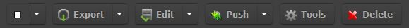
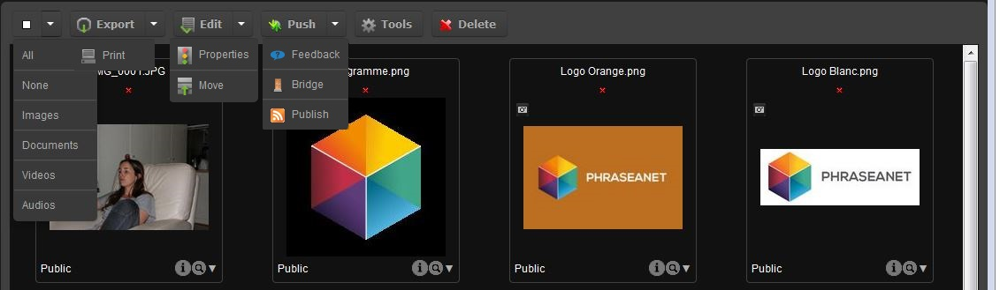

Actions palette
===============
.. toctree::
    :maxdepth: 3

.. topic:: The essential

    The actions palette in *Phraseanet Production* allows to act on the
	documents.

	Several actions are available in this :term:`Actions palette <Actions palette>`
    Some are basic features, others are advanced features.

	**The actions are accessible depending on the users rights**. These rights
	are customizable in the interface :doc:`Phraseanet Administration <Administration>`.  

**The basic features :**

* :doc:`Export <Export>`
* :doc:`Print <Export>`

**The advanced features :**

* `Edit`_
* `Move`_
* `Properties`_
* `Push`_
* `Delete`_
* `Tools`_

Introduction to the palette
---------------------------

The action palette is located in the upper part of the display area, below the
search form.
Depending on the user rights, the palette can have different available actions.

On the right of some action buttons, there is an arrow giving access to a pop-up
menu with more options.

The basic features
------------------

Export and Print
****************

Several export modes are available : download, send by email or send via :term:`FTP <FTP>`.
Printing completes the basic functions of the action palette.

:doc:`Refer to the Export and Printing section in Phraseanet <Export>`.

The advanced features
---------------------

The advanced features are accessible using the action palette buttons or using
actions pop-up menus.

Edit
****

This function allows editing records in *Phraseanet* : media and baskets edition
Complete or modify the assets documentary descriptions, either one by one or by
batch.

:doc:`Refer to the Edit section <Edit>`.

The pop-up menu of the Edit button also regroups the functions *Properties* and
*Move*.

Properties
^^^^^^^^^^

This action allows to modify : 

* the :term:`statuses <Status>` of the records
* the *mimes types* of the selected documents

Modify the records status
~~~~~~~~~~~~~~~~~~~~~~~~~

The :term:`status <Status>` allows to categorize records by giving an indicator
corresponding to a state.
They are implemented in *Phraseanet Administration* (define and choose the
related minilogs).
Through the users management, it is possible to link users rights depending on
the status state.

.. note::

	There are 32 :term:`statuses <Status>`. 28 are customizable and can be used
	for *workflow* needs or the implementation of records access restrictions.
	A status change is also directly available from the :doc:`Edit <Edit>`
	window.

* Select one or more thumbnails, one :term:`basket <Basket>` or one 
  :term:`story <Story>` then click on properties.

The window opens.

.. image:: ../../images/Actions-Properties-status.jpg
    :align: center

* Check the corresponding :term:`status(es) <Status>` (multiple statuses
  possible)
* Click on **Validate** to save the changes.

Modify the documents type
~~~~~~~~~~~~~~~~~~~~~~~~~

This action allows to change the documents type that are automatically set when
importing in *Phraseanet*.

It is useful when some documents were not correctly interpreted when imported,
so you can manually associate them to the correct file type or *mime* type.

* Select one or more thumbnails, one :term:`basket <Basket>` or one 
  :term:`story <Story>` then click on properties.

The window opens.

* Click on the **Type** tab then change the documents type.
* Click on **Validate** to save the changes.

.. image:: ../../images/Actions-Properties-types.jpg
    :align: center

Move
^^^^

**Move** allows to move media from one :term:`collection <Collection>` to an
other.

* Select one or more media then click on the **Move** section.

.. image:: ../../images/Actions-Move.jpg
    :align: center

* Select the collection in which the media shall be moved
* Click on **Validate** to move the media

The media are then moved to the selected collection.

.. note::
	
	Asynchronous, the interface does not handle real time change of collections.
	Search again for the media to check if they were successfully moved.

Push
****

The button :term:`"push" <Push>` and its pop-up menu regroups the *Validation*
function, the *Bridge* function and the *Publish* action.
These functions allow to push and promote records towards recipients or
applications.

* :doc:`Refer to the Push and Validation section<Push>`.
* :doc:`Refer to the Bridge section<Push>`.
* :doc:`Refer to the Publications section<Push>`.

Delete
******

This action allows to delete :term:`records <Record>` (Baskets, documents from
the Phraseanet :term:`base`/Collection, Stories).

* Select the records to delete then click on the **Delete** button.

.. image:: ../../images/Actions-Delete.jpg
    :align: center

A message box asks for the deletion confirmation.

Tools
*****

Tools regroups the actions allowing to act on the thumbnails or preview images
(re-generation, substitution, rotation, preview thumbnail for videos), on the
substitution of original documents or sub-definitions, or to display all the 
existing metadatas information in a selected document.

* Select one or more documents then click on **Tools**.

The Tools window opens.

.. image:: ../../images/Actions-ToolsPictures.jpg
    :align: center

Choose one of the suggested tabs :

* **Regenerating the sub-definition** : to re-generate new thumbnails and
  sub-definitions for the selected records.
* **Video tools** : Available only if the selected media is a video, the tab
  shows the tools in order to choose a customized preview thumbnail.

.. image:: ../../images/Actions-ToolsThumbnailVideo.jpg
    :align: center

* **Rotation** : Rotate the thumbnails and preview images for the selected media
* **Substitution** : Replace the original document by an other. A checkbox
  allows to choose if the thumbnail and the preview image have to be rebuilt.
* **Substitution of the sub-definitions** : Replace the thumbnail and preview
  image by an other file.
* :term:`Metadatas <Metadatas>` : Display all the :term:`EXIF <EXIF>`,
  :term:`IPTC <IPTC>`, :term:`XMP <XMP>` metadatas informations readable in a
  selected document. This tab is available if only one document is selected.

To apply the changes, click on **Validate**.
