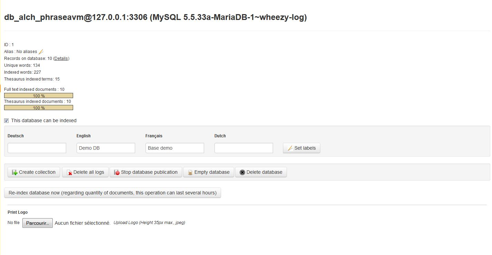
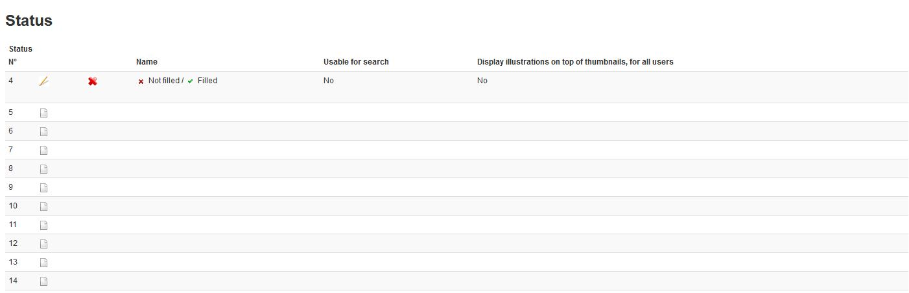
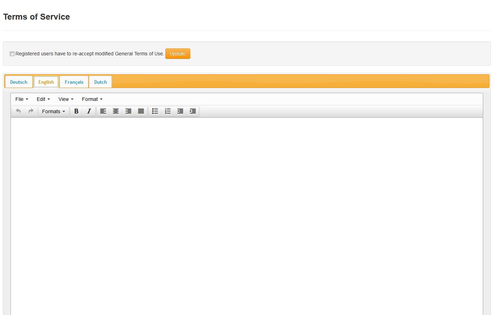

Phraseanet bases and collections administration
===============================================
.. toctree::
    :maxdepth: 3

.. topic:: The essential

	A Phraseanet application is organized in bases and collections.
	Each of the	bases corresponds to a customizable documentary structure, the
	collections can be treated as base subsets.

Customization per base
----------------------

Click on a base to display the status tab of a Phraseanet base.

This screen shows the indexation state of the base and allows the following
actions :

* Base re-indexation
* Collections creation in a base
* Logs deletion
* Records purge of a base
* Base deletion

Multi-base system, each base of a Phraseanet solution is finely customizable. To
do so, click on the **+** icon.

Setting the structure
*********************

The section **Setting the structure** allows to display the documentary
structure of the selected base as a writeable XML file.

.. image:: ../../images/Administration-xmlstructure.jpg
    :align: center

It's unlikely to have to customize a base using this interface, the interfaces
`Fields`_ , `Sub-definitions`_ or `Status settings`_ are more convenient to
use to change the settings.

Fields
******

The section **Fields** allows to define and edit the documentary structure of a 
Phraseanet base using forms in a graphical interface.

.. image:: ../../images/Administration-fieldstructure.jpg
    :align: center

Each of these fields of the documentary structure is defined by customizable
properties :

* A title
* Text type, multivalued text or date
* Labels or localized labels depending on the interface languages
* A mandatory presence or not
* An optional data source
* An optional :term:`Dublin Core <Dublin Core>` source
* An optional :term:`Business field <Business field>` property
* The order
* ...etc.

Sub-definition
**************

The section *Sub-Definition* allows to add and edit the media sub-definitions
for picture, videos, audio type integrated in Phraseanet.

.. image:: ../../images/Administration-subdefinition.jpg
    :align: center

The nature of the sub-definitions depends on the nature of the original
documents integrated in Phraseanet.
The table below lists some typical examples of sub-definitions created by the
application.

+---------------------------------------+-------------------------------------+
| Nature of the original Media          | Nature of the sub-definition        |
+=======================================+============+==========+=============+
| Jpeg, psd, gif, png... pictures       | Jpeg sub-definition                 |
+---------------------------------------+-------------------------------------+
| Mpeg, Avi, Mov... video               | Mpeg4 sub-definition                |
+---------------------------------------+-------------------------------------+
| Wav, Mp3... audio                     | Mp3 sub-definition                  |
+---------------------------------------+-------------------------------------+
| Pdf, Word... office document          | Flash animation (Swf)               |
+---------------------------------------+-------------------------------------+

.. warning::

	The thumbnail and preview sub-definitions are essential.
	They are used in the Phraseanet interfaces to display the thumbnails and
	preview images of the media.

Status settings
***************

The :term:`Statuses<Status>` are markers that indicates states on records.
They interact or not with the users rights (see **Limitation by statuses** on 
the page dedicated to the :doc:`User management<UserAdministration>`).

In Phraseanet, a status is either down (default state), or up.
In practice, the statuses allow to set states on documents and if needed, narrow
the users restrictions of these documents.

Linked to the documentary structure of a base, it is possible to integrate up to
28 statuses.

* To declare a status, click on the Page icon to edit a new status bit then fill
  the form.	
* To modify en existing status, click on the Pen icon.
* To delete a status, click on the Cross icon then confirm the deletion.

General terms and conditions of use
***********************************

The general terms and conditions of use are shown to the users when they sign-up

* Fill or copy / paste a text in the different proposed languages.
* Check the "The users...." box to make the existing users validate the updated
  conditions and terms.
* Click on Update to save the changes.

Collections sorting
*******************

.. image:: ../../images/Administration-collectionsorting.jpg
    :align: center

By default, the collections are displayed in Phraseanet by creation date. It is
possible to modify this order.

* Click on the section **Collection sorting**
* Click on a collection
* Click on Up, or Down or on "Alphabetical order"
* Click on Validate to save the changes

The collections
---------------

The collections are subsets of a base they share the settings with. The
implementation answers to the segmentation needs of documentary assets and/or
the assignment of specific users rights.

Create a collection
*******************

To create a collection, click on the title of the base in which the collection
shall be created then click on **New collection**.

.. image:: ../../images/Administration-createcollections.jpg
    :align: center

Specify the name of the collection to create in the name field then validate
the form.

.. note::

	When creating a collection, it is possible to apply (duplicate) users rights
	from an existing collection.

Display a collection
********************

Click on the title of the collection to display its information.

.. image:: ../../images/Administration-displaycollection.jpg
    :align: center

This screen shows the essential information on the collection.
It allows to rename it, deactivate it (see section :ref:`activate-collection`),
purge it or delete it.

Display the details of a collection
***********************************

Click on **Details** to display an inventory of the collection contents.

.. image:: ../../images/Administration-displaydetails.jpg
    :align: center

The table lists the objects composing the collection (records, documents,
sub-resolutions, thumbnails), the number of objects, the size in mega-bytes,
the size in giga-bytes.

To hide the details of a collection, click on **Back**.

Managing the order manager
**************************

An order manager is a user that has a response right on the download requests
on original documents sent by users who do no have the rights to download them.

.. note::

	The order managers receive download requests notifications in the Phraseanet
	interface and by email.

**To add an order manager**, on the displayed collection, type the user's name
or surname or login in the form to add a manager.

.. image:: ../../images/Administration-ordermanager.jpg
    :align: center

An auto-completion system guides the user by suggesting users choices. Click on
the user then apply the choice using the **Validate** button.

**To delete an order manager**, uncheck the box before his username then apply
using the **Validate** button.

Branding a collection
*********************

To brand documents published on other sites using Phraseanet, select one of the
three suggested options in the group of radio-buttons.

.. image:: ../../images/Administration-collectionbranding.jpg
    :align: center

* Check the box **By default** to not brand,

Or

* Check the box **Watermark file** to apply the default watermark or use a
  pre-uploaded watermark file,

Or

* Check the box **Notification banner** to add a banner under the last pixels
  line of the files (this requires setting up the "fields" and "logo" 
  information to display on the banner).

Other actions on the collections
********************************

A form regroups other actions on the selected collection.

.. image:: ../../images/Administration-collectionotheractions.jpg
    :align: center

.. _activate-collection:

Activate or de-activate a collection
^^^^^^^^^^^^^^^^^^^^^^^^^^^^^^^^^^^^

By default, the collections are activated when created. This means that they are
published and that the users that can access them can browse their contents.

**To de-activate a collection** and stop its publication, click on
**De-activate the collection**.

Conversely, **to activate a collection**, click on **Activate the collection**.

Rename a collection
^^^^^^^^^^^^^^^^^^^

Click on *Rename* to change the name of the collection.
Type the new name in the field that appears then click on **Send**.

Empty a  collection
^^^^^^^^^^^^^^^^^^^

Emptying a collection deletes permanently all its records (documents, notes,
sub-definitions).

This action is permanent.

Click on **Empty the collection** to delete all the records of the collection.

Delete a collection
^^^^^^^^^^^^^^^^^^^

Click on **Delete** to completely delete the collection from the base.

.. note::

	A collection must be empty to be deleted.

Customizing a collection
************************

A collection is customizable by a set of distinctive graphical elements.

Minilogo
^^^^^^^^

To add a logo representing the collection (it appears in the *Classic* and
*Production* interfaces under the thumbnails in the bottom right corner) :

* Click on the **Browse** button to select the logo file (maximum recommended
  size : 30 pixels height).

* Click on **Send the logo** to download the logo in the Phraseanet bases.  

Watermark
^^^^^^^^^

Use the proposed form to add a customized watermark in order to apply it to all
sub-definitions of the collection's documents.

.. note::

	A watermark is applied to the picture documents viewed by the users that
	have the "No watermark" right unchecked.

:doc:`Refer to the section dedicated to the Watermark in the FAQ.<../../FAQ/Customization/Watermark>`

Preferences : Suggested values
******************************

The suggested values are pull-down menus that appear in the :doc:`Edit <Edit>`
window to enable a rapid indexation. They are editable by collections and by
fields.

The edition of suggested values is possible using an edition form in graphical
mode.

.. image:: ../../images/Administration-graphicalmodevalues.jpg
    :align: center

Some other users prefer to use the XML view mode.

.. image:: ../../images/Administration-xmlvalues.jpg
    :align: center

* Select the fields in which you want to work
* To add a value, type it in the intended area and click on Add

It is possible to sort the values by clicking on a value then "Up" or
"Down" or to sort them by alphabetical order by clicking on *Alpha sort*.

To delete, click on a value then click on Delete.
