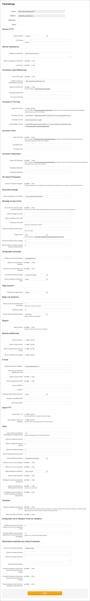
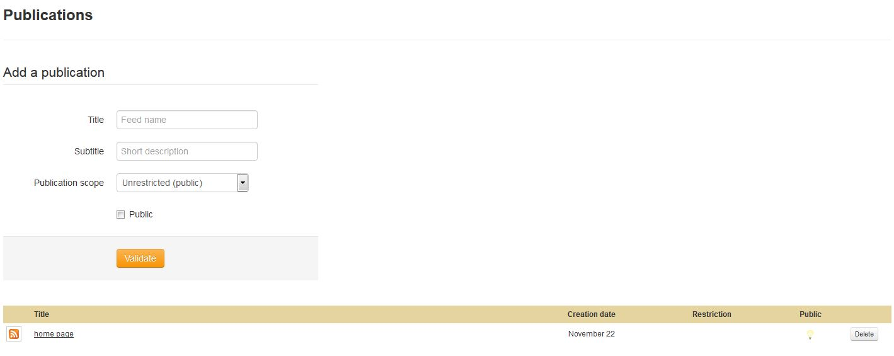

Application's Administration 
============================
.. toctree::
    :maxdepth: 3

.. topic:: The essential

    The administration of the application consists in monitoring the solution's
	operations and changing settings if necessary.

Dashboard
---------

.. image:: ../../images/Administration-dashboard.jpg
    :align: center

**Accessible only by Phraseanet administrators**, the *dashboard* allows to add
or remove Phraseanet administrators.

**Phraseanet administrators** are users that have the rights to manage and
maintain the application.

Among other things, the dashboard displays an overview of the configuration
state of the file system, executables, extensions, cache servers and web servers
involved in the implementation of *Phraseanet* solution.

Settings
--------

**Accessible only by Phraseanet administrators**, the *Settings* screen have
a graphical interface that allows to modify the installation and configuration
settings of the Phraseanet instance.

Setup have a set of forms allowing to :

* **Modify the addresses and the paths of the application** or components that 
  allow its implementation.
* **Put the application in maintenance mode**
* **Activate or deactivate connections to web services**
* **Activate or deactivate connections to social networks** implemented in the 
  :ref:`bridge-share`
* **Activate or deactivate features and options of the application**

.. warning::

    "Setup" allows to deeply modify the installation settings of the 
	application. The administrator must pay attention to modifications brought 
	in the proposed forms.

Search engine settings
----------------------

This section allows to configure the search engine used by the instance using
graphical interfaces.

.. note::

    This section is dedicated to systems administrators in charge of the 
    Phraseanet deployment

    `Refer to the page dedicated to the engines configuration in the 
	 Administrator documentation <../Admin/Configuration>`_.

Phrasea engine configuration
^^^^^^^^^^^^^^^^^^^^^^^^^^^^

The Phrasea engine, which is the default engine, has few configuration options.

The settings interface offers to set the available date fields for searching and
to choose the display order of the records.

Sphinx engine configuration
^^^^^^^^^^^^^^^^^^^^^^^^^^^

The form allows to write the configuration of the Sphinx search engine in use.

Connected users
---------------

Displayed by default during the connection to Phraseanet Admin, the screen
lists the active users sessions in the system.

It tells which Phraseanet application is used, the IP address, and also the date
and time of connection to the system.

.. image:: ../../images/Administration-liveuser.jpg
    :align: center

.. note::

    Phraseanet relies on a mechanism of *persistent sessions*. The connection's
	dates and times correspond to the initialization of the user's session.

Publications
------------

Accessible by users who have the publications management rights, the 
publications section allows to manage mediaRSS streams broadcast from the 
Phraseanet application.

The Publications screen displays the list of the available media streams to
publish and allows to create, modify or remove some media streams.

* **To create a stream**, fill in the addition form then validate
* **To modify the properties of an existing stream**, click on the stream to
  modify in order to open the edition form of the selected stream.
* **To remove a stream**, click on the Delete button.

Task manager
------------

**Accessible only by Phraseanet administrators**, this screen allows to manage
archiving tasks, and other automatic treatments applied on the 
:term:`Bases<Base>` and :term:`Collections<Collection>` of the application.

The tasks are listed in a table that indicates the task identifier, its name,
and if it is active or not.

.. image:: ../../images/Administration-taskmanager.jpg
    :align: center

The principle of an *Archiving task* is to scrutinize a directory, and to 
archive its content by copying the files in the storage directories of the base
of destination.

* **To start a task**, click on the symbol, then click on *Start*.
* **To edit a task**, click on "Edit".
* **To stop a task**, click on "Stop".
* **To create a new task**, click on "New task".

.. image:: ../../images/Administration-tasks.jpg
    :align: center

New task
^^^^^^^^

The task settings in Phraseanet allows to set up treatments automatisms.
The standard version of the solution is delivered with a set usable of tasks.
The user can create more tasks.
These tasks are stored as XML files in the application.

* Select one of the tasks template available in the **New task** menu.

.. image:: ../../images/Administration-newtask.jpg
    :align: center

* Edit the settings of the task in the XML view.

.. image:: ../../images/Administration-edittask1.jpg
    :align: center

* Click on **Validate** to save the modifications.

The graphical view simulates the task execution.

.. image:: ../../images/Administration-edittask2.jpg
    :align: center

* Launch the task.

.. image:: ../../images/Administration-starttask.jpg
    :align: center

.. note::

    For more information on the tasks settings, refer to the page
	:doc:`../../Admin/TaskManager`.
