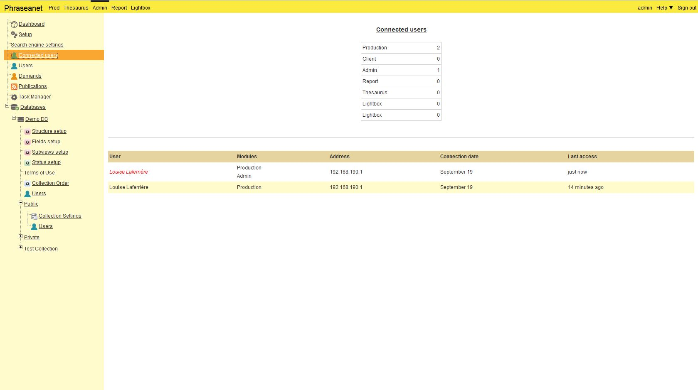
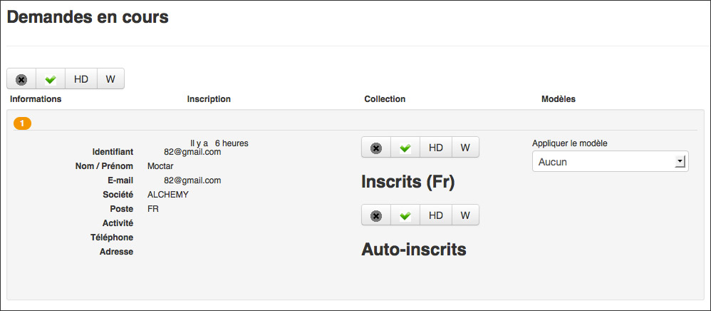

Users Management
================

.. toctree::
    :maxdepth: 3

.. topic:: The essential

    **Available for users who have the users management rights**, the users 
	interface allows to manage the users list saved in the Phraseanet
	application and to give them some rights.

The *Users* interface allows to :

* Create new users
* Validate users registration's requests
* Manage users rights
* Create templates applicable to users
* Set a guest access with specific rights

By default, the interface displays the list of users who are referenced on 
Phraseanet.

Concepts related to users and their rights
------------------------------------------

In Phraseanet, if a user does not see a function, it is certainly because he
does not have the access rights for this function.

**For example**, if a user does not have the rights to access to a collection, 
he will not see the collection and might never know that this collection exist.

**This is also true for the interfaces** : some users might have access to some
specific modules or features dedicated to consultation.
Administrators, can have access to more interfaces (such as *Administration*,
*Report*, *Thesaurus* or *Upload*).

Finally, **it is not possible for a user with users management rights to give 
more rights than he has himself**.

.. note::

    A user who have no allocated rights is a ghost user.
    He is recognizable by a ghost icon in the users list.

.. image:: ../../images/Administration-ghostuser.jpg
    :align: center

Sort existing users
-------------------

It is possible to sort the users list by criteria such as the identifier,
the family name/first name, email, country or the company.

.. image:: ../../images/General-Administration-sort.jpg
    :align: center

Create, modify, remove a user
-----------------------------

Create a new user
*****************

Click on the button  **New user**.

.. image:: ../../images/Administration-newuser1.jpg
    :align: center

An overlay window opens.

Enter the e-mail of the new user and click on  **Create a user**.

.. image:: ../../images/Administration-newuser2.jpg
    :align: center

The window of users rights management window for the created user opens.

.. image:: ../../images/Administration-newuser3.jpg
    :align: center

To know how to manage the user's rights, refer to the section `Rights edition`_.

To edit information relating to the user's details, click on the tab
 **Information** then edit the proposed form.

.. image:: ../../images/Administration-newuser4.jpg
    :align: center

Implement the changes and click on the the button **Validate**.

.. note::

    If some users are created by the users management interface, the e-mail 
	address is used as the identifier.

Modify the user's rights
************************

To modify the rights or information of a tool, double click on the user's name.

For more information relating to the user's rights, refer to section
`Edition rights`_.

Delete a user
*************

To delete a user from Phraseanet, select the user in the list and click on the
button **Delete**.

Create users templates
----------------------

It is possible to create templates and apply them to one or several users.
These users will have the same rights as the template.

.. note::

    Templates belong to users who created them. They will not be visible by the 
	other administrators.

In the user's list, a template is recognizable by the symbol **M**.

.. image:: ../../images/Administration-usertemplate.jpg
    :align: center

To create a user's template, click on **New template**.

.. image:: ../../images/Administration-Bar-template.jpg
    :align: center

An overlay window displays a date entry form.

.. image:: ../../images/Administration-template1.jpg
    :align: center

Give a name to the new template then validate the form.

A window opens and displays the edition **Rights** form to edit the rights of 
this new template.

.. image:: ../../images/Administration-edittemplate.jpg
    :align: center

Set the template, then validate the form.

It is possible to link several users with a template and manage collectively the 
rights of many users through the templates.

.. image:: ../../images/Administration-applytemplate.jpg
    :align: center

The guest access
----------------

**The guest access** can be set up in Phraseanet, if desired.
It allows to have an access (even temporary) to the application for users who 
 are not registered in the system.

To set up the guest access, click on the link **Guest access settings**.

.. image:: ../../images/Administration-Bar-guest.jpg
    :align: center

The guest access rights can be defined in this tab.

.. image:: ../../images/Administration-setguest.jpg
    :align: center

Edition Rights
--------------

The edition of the rights concerns the users as well as the templates.
To display the rights edition form of a user or a template, double click on the
user's name or on the template's name in the users list.

The rights sheet displays and allows to manage the **consultation and 
exploitation rights** on the left, and the **managing rights** in the broad
sense, on the right.

To have access to the user's information, click on the user's sheet, in the top 
left corner of the window (in blue below).

.. note::

    The modification of the user's rights access can be created in batches by
    selecting several users.

This frame gives the list of all the available Phraseanet bases and collections
that the user can have access to.

.. image:: ../../images/Administration-rights.jpg
    :align: center

Collections appear with the name of the base they belong to.
Collection is the notion used in the interfaces *Production*, *Classic*, 
*Report*, *Administration*.

The access for a user to Phraseanet Bases or Collections is defined in
accordance with rights. A right is granted when the corresponding box is ticked,
and is not granted when the corresponding box is unchecked.
During an edition by batches, a greyed box means that the right is only granted 
to some specific selected users.

A user cannot give more rights than he has himself(red point). The sign
"**i**" means that a window accessible a click away, define in detail the 
specific rights.

.. note::

    By clicking on the grey arrow, Phraseanet allows you to tick or uncheck the 
	entire column, instead of ticking boxes one by one.

Consultation rights
*******************

The first part and leftmost of the rights window : 

* Tick **Access** to allow access to a Phraseanet Base or to the collection
* Tick **Active** to activate the user. Conversely, unchecking the box allows to 
  disable the user without loosing the settings.
* Tick **Baskets** to allow baskets creation.
* Tick **See Preview** to allow the display of specific pictures.
* Tick **Watermark** to define if the user sees specific pictures with a 
  brand or a watermark.
* Tick *Download HD** to allow the original document download.
* Tick **Order** to allow to order the documents.
* Click on **Quota** to open the window *Download quota*.

Many specific options are available to the user for the limitation :

Limitation by Quotas
^^^^^^^^^^^^^^^^^^^^

The window "Downloads quota" allow to define the quota of download per
Phraseanet base or collection.

* Tick Yes to activate the quotas management.
* Enter the number of authorized downloads per month for this collection.
  The "rest" is automatically calculated according to the initial right and the
  number of downloads.
* Click on the "Validate" button to save the setting and close the window.

Limitation in time
^^^^^^^^^^^^^^^^^^

Click on **Limité Temps** to open the window *Durée de vie*

This window allows to set a time limit for the access to a Phraseanet base or
collection.

* Tick Yes to activate the time limit management.
* Select the beginning and the end of the allowed access time.
* Click on the "Validate" button to save the setting and close the window.
* Click on **Status** pour to open the *Status* window.

Limitation through Status
^^^^^^^^^^^^^^^^^^^^^^^^^

Limitation through status allows to hide records from the user according to
the state of one or several status.

*Refer to the settings of the base for the creation and the management of the 
status bits.*

Click on the "Validate" button to save the setting and close the window.

Exploitation and management rights
**********************************

The second part of the rights window allows to define administrative rights,
that is to say, the accessible actions for the user, through the signs on the
"Actions palette" among other.
Tick the box to give access to the relevant right on a Phraseanet base or
collection. 

**Documents**

* Tick **Add** to allows the addition of document in a Phraseanet base or 
  collection.
* Tick **Edit** to allows the edition of the documents description.
* Tick **Modify status** to allow the user to change the status of a document.
* Tick **Delete** to allow the user to delete a document.
* Tick **Picture tools** to allow the user to access the tools.
* Tick **Users management** to allow users management.
* Tick **Consult reports** to allow the user to consult the statistics.
* Tick **Push** to allow the use of the *Push* function and the sending of
  documents to their recipients.

**Base and collections management rights**

* Tick **Coll. management** to allow the user to do several actions of management.
  For an example, for a collection: Rename it, empty it, put it on-line or 
  off-line, delete it.
* The box **Coll. Structure** gives access to the collections settings in 
  *Phraseanet Administration*. "Structure Coll." allows the access to the 
  collection preferences and permits the modification of the suggested values 
  list.
* The box **Basket publication** allows a user to publish in the form of 
  baskets, documents on pages of the application *Classic*.
* The box **Thesaurus Modification** allows the user to access the application
  *Phraseanet Thésaurus*
* The box **Base management** allows to access the functions of settings of 
  databases as creation, purge and advanced functions of the solution 
  management.

"Requests"
----------

Available through the Administration module menu, this window shows the 
application requests of new users on the *Inscription* screen.
If a user make a request on several collections, the number of validation lines 
will be the same as the number of requests.
A "rollover" on the name allows to display the information related to the
applicant.

Select the rights to allocate per collections by ticking the boxes.
The user can :

* Deny the access to the requested collection.
* Give access to the requested collection, to the documents in sub-definitions.
* Give access to the requested collection, with documents in high definition.
* Give access to the requested collection, without documents in high definition.

Click on **Validate** to apply the selected choices.