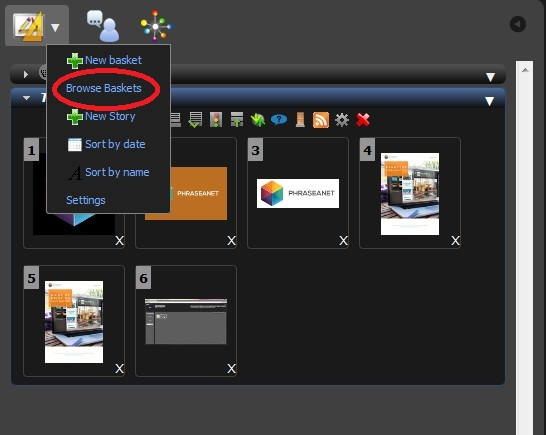

Baskets and Stories
===================
.. toctree::
    :maxdepth: 3

Baskets and stories are located in
:doc:`the work area <Tabs>` on the same tab.
In the interface, they are recognizable by their colours :

* *Grey* for the baskets
* *Golden* for the received baskets but not opened yet.
* *Blue* for the stories

The Baskets
-----------

.. topic:: The essential

    A :term:`Basket <Basket>` is used to collect some documents and to work on
	them.
    A basket in not "searchable" and belongs to the user who created it.
    Mousing over the title bar allows to display its content in a modal window
    (title, description, date, content...)

Some icons displayed in the title bar give further information about the 
baskets.

.. todo::

    Add the icons that explain

* Blue tooltip : Request for a validation receipt
* Red tooltip : Request for a validation done by the user
* Push icon : Shows that the basket has been received

To open or close a window, click on the title bar.

Each basket has a :ref:`pop-up menu<basket-menu>` that allows to do the 
following actions :

* *Export* to download the basket content
* *Lightbox* to display the basket's content in 
  :doc:`Phraseanet Lightbox interface<Lightbox>`
* Rename the basket
* Archive to move away the basket from the work area
* Delete to delete the basket without altering the content
* Order, to change the order of display of some documents in the basket

The baskets (and the stories) have a range of tools that complete the actions 
proposed by the pop-up menu.

How to create a new basket ?
****************************

There is no default basket session. The user has to create it.

* Click on the pop-up menu of the tab
* Click on *New**

* A window opens

* Enter the basket's name and a description if necessary.
* Tick the box **Add my current selection** to add beforehand selected documents 
  in the results.
* Click on the **Create** button.

The new basket is created and is available in the list.

Add documents to a basket
*************************

From the results
^^^^^^^^^^^^^^^^

* To put one or several documents in an existing basket :
  Do a drag and drop of one or several thumbnails, either by a mouse over the 
  basket's name, or by putting the selection in the open basket.

.. note::

    Added documents are displayed lastly in the basket. They can be sorted 
	differently if necessary.

From a detailed view
^^^^^^^^^^^^^^^^^^^^

* -> Select a basket by clicking on its title. This basket becomes the active 
     basket
* -> Launch the detailed view on a selection of documents
* -> Click on the icon "Basket" to add the document in the active basket.
.. note::

    An active basket correspond to an open basket.

Select documents in the baskets
*******************************

The selection of documents in a basket is made the same way as in the 
display area. Refer to the section relating to the selections in the dedicated
page at:doc:`affichage <Afficher>`.

How to display a basket's content with a detailed view?
*******************************************************

* -> Double click on the basket's thumbnail
* => The window with the detailed view opens and displays the basket's content.

How to move or duplicate documents from a basket to another?
************************************************************

**To move one or several documents from a basket to another** :

* Select the documents to move
* Drag and drop the documents in the bar title of the destination basket

**To duplicate one or several documents from a basket to another** :

* Keep the key "ctrl" pressed on PC or the key "cmd" on a Macintosh
* Select the documents to move
* Drag and drop the documents in the title bar of the destination basket

How to remove a document from a basket ?
****************************************

To remove a document from a basket :

* -> Click on the "cross" located under the thumbnails

.. image:: ../../images/Prod-Bonglet-panierretirerdoc.jpg
    :align: center

Actions on the baskets or their content
***************************************

Actions on the baskets work the same way as the actions on the documents from 
the results window.

Refer to the dedicated section at :doc:`tools panel <Actions>`.

.. _basket-menu:

Baskets pop-up menu
***********************

* -> Click on the arrow of a basket's pop-up menu
* -> Select an action

Rename a basket
^^^^^^^^^^^^^^^

* -> Click on *Rename*
* -> In the window, indicate the new name, and a new description if necessary
* -> Click on validate

Change the order of a basket
^^^^^^^^^^^^^^^^^^^^^^^^^^^^

* -> Click on "order"

* -> Use the sort menu.
* -> **or** Reverse the order.
* -> **or** Select the documents and drag and drop them between other documents.
* -> Click on validate.

Remove a basket
^^^^^^^^^^^^^^^

* -> Click on **Remove**
* -> A window opens and ask for a confirmation for a final removal of the 
     basket.

Baskets archiving
*****************

Archive a basket
^^^^^^^^^^^^^^^^
As a result of the creation of numerous baskets, the work area might be 
cluttered by baskets that should be  kept for one reason or another. To archive
them, use **Baskets archiving**.

**To archive a basket**, open the pop-up menu of the basket and click on
**Archive** :

The basket disappear from the side work area.

Then, it can be used in the future without cluttering the work area.

Find an archived basket
^^^^^^^^^^^^^^^^^^^^^^^

**To find an archived basket**, refer to the baskets history.
click on the arrow located in the baskets title bar, then click on the section
 *Browse the baskets* :

A window opens:

A search area displays in this window. It allows to search the baskets by their 
titles.
The following criteria can also be used :

*Look* : All, my baskets, received baskets, sent validations, received 
validations.

*When* : The entire period, This year, last year, ranking per year.

The other part of the window displays the list of the baskets : for each basket,
the following information are displayed :  number of pictures, a picture of
representation, a title,...

By clicking on the basket's title, the thumbnails appear :

How to archive or unarchive a basket ?
^^^^^^^^^^^^^^^^^^^^^^^^^^^^^^^^^^^^^^

**To archive or unarchive a basket** from the basket history,use the "star" icon 
displayed next to the basket's title.

* A yellow star means that the basket is displayed in the work area.
* A white star means that a basket is archived.

Click on the "star" icon to change the archiving state of the baskets.
Modifications are visible in real time in the work area.

Stories
-------

.. topic:: The essential

    A story is made up with documents from the same Phraseanet base.
    The story is a record in a collection (a descriptive sheet, a document, a 
	preview picture and a thumbnail) that includes other records. Unlike a 
	basket, **a story can be searched**.
    A story belongs to one of the collections of the Phraseanet Base and has its
	own documentary instructions.
    It is possible to describe a story as soon as it is created or 
	*afterwards* by relying on the documentary content of the records added, 
	or the combination of the documentary contents.

.. note::

    Most of the available functions on the *Baskets* are also available on the
	Stories. Only the functions peculiar to the stories are documented.

	How to create a new story ?
*******************************

* Click on the pop-up menu in the *Baskets* tab
* Click on **New story**
* => a window opens

* Choose a collection of publication in the list of the available collections
* Indicate a name to the story
* An option allows to include eventually the active selection as a story's
  content.
* Click on **Validate**
* The Story is created. The message "open" displayed in the baskets and stories 
  tab.

How to add documents to a story ?
*********************************

* Select some documents from the results or from a basket
* Drag and drop the documents in the title bar of the story or directly in the 
  story, if the story is open.
  
The red tooltip indicates the number of documents placed in the story. A
notification is also displayed in the top right corner of the screen.

How to archive or unarchive a story from the tab ?
**************************************************

The stories are placed in the tab in order to facilitate the user's work.

Attach a story
^^^^^^^^^^^^^^

* -> Research in the story mode and select one or several stories to attach to 
  the work area.
* -> Drag ad drop the stories from the displayed results area to the work area.
* => The stories displayed.

Detach a story
^^^^^^^^^^^^^^

There is no interest to keep a completed Story  in the tab. In order not to
clutter the work area, stories can be detached :

* Click on the pop-up menu of the story
* Click on **Detach**

the story is detached and does not appear anymore in the baskets and stories 
tab of the work area.

How to reattach a Story to the work area ?
^^^^^^^^^^^^^^^^^^^^^^^^^^^^^^^^^^^^^^^^^^

The most simple way is to search the story, then to select it and drop it in 
the work area in order to edit its content.
