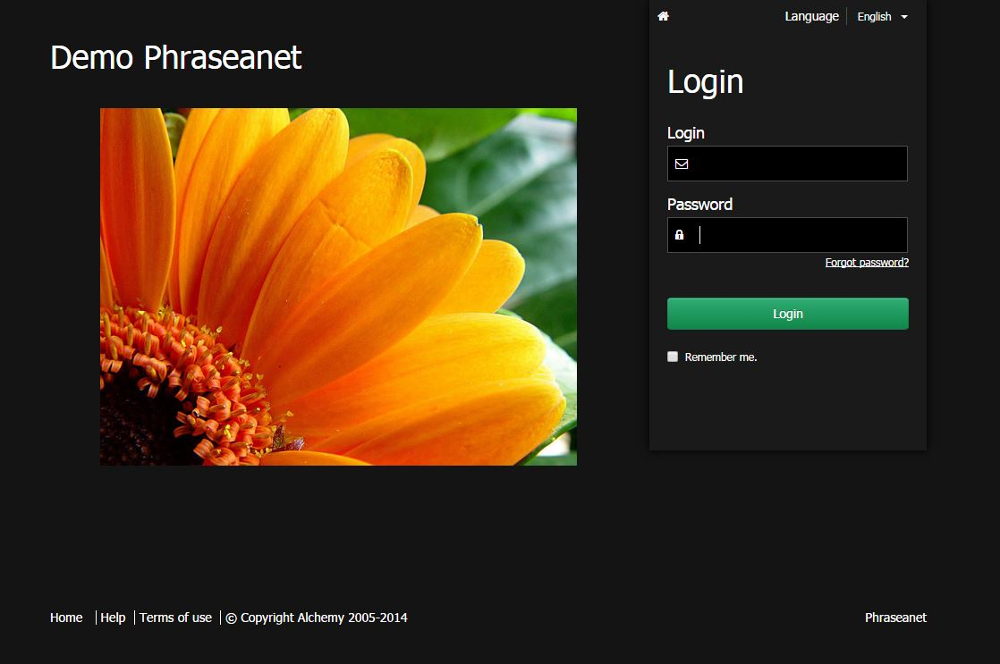

Connection to Phraseanet
========================

Even if is possible to view a *Phraseanet* asset as a guest user, a user can
have to create an account and authenticate to access some multimedia assets.

Authentication
--------------

* Connect at the internet address of the Phraseanet solution using a web browser
  The homepage for the connection displays :

* Adjust if needed the language of the interface using the drop down menu
  *Language*.
* Type the username
* Type the password
* Click on **Connection**
* If the password is forgotten, follow the lost password procedure by clicking
  on the *Password forgotten?* link.

Authenticating using third party application
--------------------------------------------

*Phraseanet* allows to delegate the user authentication to a third party
application.

.. image:: ../../images/Authentication-oauth.jpg
    :align: center

In the 3.8 version, the homepage allows to authenticate using the following web
applications : 

* Facebook
* Twitter
* Gmail
* GitHub
* Viadeo
* Linkedin

Other identity suppliers can be added.

Sign up
-------

Depending on the system settings, a link allowing to sign up as a new user can
exist in the connection page of *Phraseanet*.

* Click on **Sign up** in the homepage

.. image:: ../../images/Authentication-sign_up.jpg
    :align: center

* Click on the **Create manually an account** button then fill and send the form

**Or**

* Connect using a remote authentication by selecting the identity provider

.. image:: ../../images/Authentication-choice-sign_u^p.jpg
    :align: center

* Fill and send the form.

.. note::

	Even with an identity provider, a password must be given during the
	signing up process. This password is for the local *Phraseanet* account. It
	can be different from the one used with the identity provider.

When the form is sent, the homepage shows and informs the user that his sign up
request was received. A *Phraseanet* admin will then complete the process.

Password lost ?
---------------

Click on the **Password forgotten ?** link.
Fill the form on the page "Password forgotten" with the email address linked to
the Phraseanet account.

Once the form is completed and sent, an email is sent. It contains a secured
link to the interface used to reset the password.

.. note::

	The link is only valid for a limited time.
	If the email is not received, check the Spam folder of the mail application.

Click on the link in the email to reach the interface to reset the password.
Follow the instructions then validate the form to reset the password.

.. warning::
	
	The passwords are case sensitive.

After resetting the password, connect using the homepage form of Phraseanet.

The guest account
-----------------

The guest account is an account like any other *Phraseanet* account. Il allows
to view one or more collections without authentication.

Once the guest access is configures, a button **Guest access** is displayed in
the bottom of the connection page.

.. image:: ../../images/authentication-guest.jpg
    :align: center

Refer to
:doc:`this section <../../FAQ/Customization/Setting-Guest-Account>`
to set the guest account.

.. note::

	When connecting to *Phraseanet*, it is the last used application that is
	launched by default.
