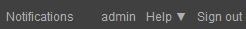

Customize the interface
=======================

Adjust the displaying area size
********************************

Knobs allows to adjust the size of the displaying area in
*Phraseanet Production* interfaces.
The knobs must be selected and moved in order to adjust the size of the areas.

Resize the working area
-----------------------

Click on the tab between the working area and the results.

.. image:: ../../images/Tab-Size.jpg
    :align: center

Move the cursor to the left or to the right to resize the display area.

Release the cursor when the number of thumbnails per line in the working area is
reached. Then, the application adjusts the space to optimize the display.

Hide or display a working area
******************************

The working area can be minimized :

.. image:: ../../images/Tabs-Minimize1.jpg
    :align: center

Click on the icon on the right side of the screen to minimize the working
area and maximize the display area and the results.

.. image:: ../../images/Tabs-Minimize.jpg
    :align: center

When minimized, click on any part of the working area to show it instantly.

Notifications setting
*********************

The right part of the menu bar shows the notifications. A number can appear. It
gives the number of unread notifications.

The notifications are linked to real time events in the application. Depending
on the user rights, these notifications can be for :

* Sign up requests,
* Transfers failures in Bridge,
* Mail export failures,
* Push receptions or validation requests,
* Order receptions or rejection by collection managers,
* Quarantine for uploaded documents,
* Newly published items.

.. note::

	The notifications are completed with eMails received at the user's address.
	The reception of notification emails is customizable in the section
	**E-mail notification** of the *Information* tab of the user account.

Click on the section **Notifications** of the menu bar to display the newest
notifications.

.. image:: ../../images/General-notifications.jpg
    :align: center

To view them all, click on the link **All the notifications**. An overlay
window recaps all the notifications history.

Display settings
****************

Preferences for results display
-------------------------------

The user can set his preferences for displaying the results. Click on the
**Preferences** button on the bottom of the window, below the results display
area.

.. image:: ../../images/Display-Preferences.jpg
    :align: center

An overlay window regroups the display and configuration settings.

.. image:: ../../images/Display-Preferences1.jpg
    :align: center

In the **Display** tab, the user can : 

* Change the display mode from *Thumbnails* to *List* (note displayed on the
  left of the thumbnails).
* Modify the colour set of the interface (Default theme : Black interface).
* Change the informations displayed when mousing-over thumbnails by checking
  Iconograph or Graphist.
* Choose to display the documents technical information (Displaying the "i"), or
  check the "Display in the note" so that the information are added under the
  documentary note when mousing-over.
* Display or not the icons of the document's type
* Modify the number of results per page
* Change the display size of the thumbnails
* Choose the document selection colour in the interfaces.

In the **Settings** tab, the user can configure the question asked by default
when connecting to *Phraseanet Production* and *Classic* interfaces.

.. image:: ../../images/Display-Preferences2.jpg
    :align: center

Click on the cross to quit the *Preferences* window. The modified preferences
are committed during the next display refresh.	

Sorting and displaying preferences for baskets and stories
----------------------------------------------------------

It is possible to change the sorting and displaying preferences for baskets and
stories. Ta access these options, click on the baskets menu.

.. figure:: ../../images/General-basketsprefs.jpg
   :align: center

It is possible to sort baskets and stories by alphabetical order by name or 
creation date.

The section **Preferences** allows to modify display settings. Click on
*Preferences* ; an :term:`overlay <Overlay>` window opens.

.. figure:: ../../images/General-basketsprefs2.jpg
   :align: center

Check or uncheck the checkbox to show or hide the :term:`status <Status>`, the
description and/or title of documents in the baskets and stories.
Close by clicking on the cross on the top right corder or by pressing on the
"Escape" key of the keyboard.
