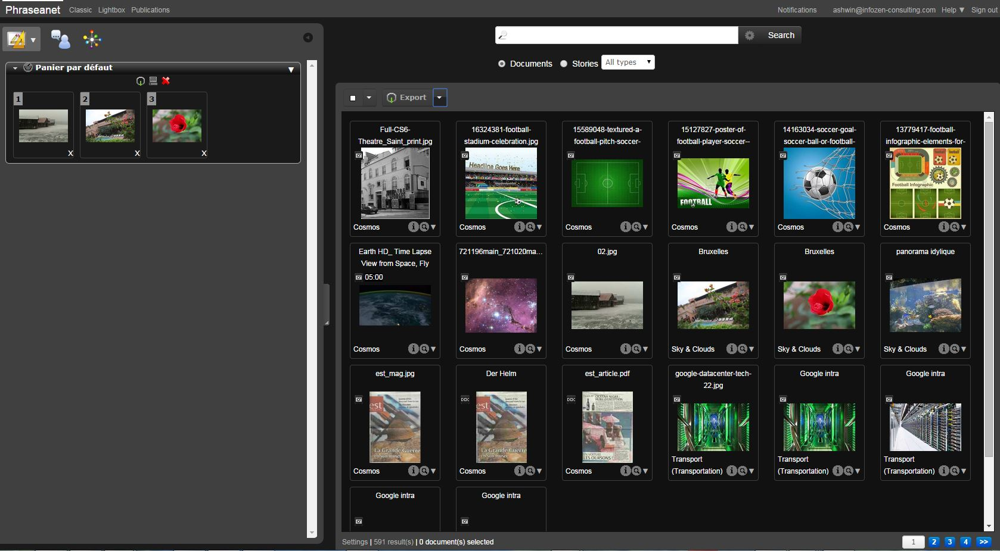
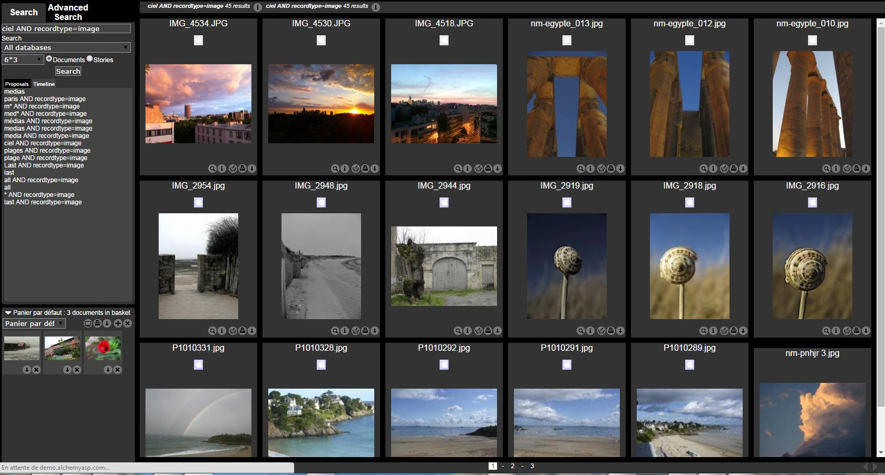

Displaying the results
======================
.. toctree::
    :maxdepth: 3

.. topic:: The essential

	The interfaces *Phraseanet Production* or *Classic* allows to consult and
	browse through media assets in *Phraseanet*.

	*Production* is an interface dedicated to viewing, searching, managing and
	editing documents, whereas the *Classic* is only for searching and viewing
	documents with older browsers.

*Phraseanet Production Interface*

.. note::

	The results area, in *Prod* (above) or in *Classic* (below), is the central
	area where the pictures are displayed.

*Phraseanet Classic Interface*

Introduction to the display area
--------------------------------

In *Production*:
The **Actions Palette** is on the top of the page, above the results area. It
allows to act on the documents.
For more information, refer to the page dedicated to the :doc:`Actions Palette <Actions>`.

The lower banner allows access to the **Display preferences**, informs on the
results number and displays a pagination of the results.
The pagination allows to move from page to page by clicking on the page number,
move to the end of the selection by clicking *Next* and come back by clicking on
*Back*.

.. note::

	Do not use the back and forward buttons of the web browser.

To access a specific page, modify the page number then validate by pressing the
**Enter** key of the keyboard.

.. image:: ../../images/Display-NbResults.jpg
    :align: center

The thumbnails have a presentation title. This presentation title is
customizable by the functional Administrators of the application.

.. note::

	How to customize the displayed documents title under the thumbnails in 
	Phraseanet ? :doc:`Refer to the Administration section of the guide
	<AdministrationBasesCollections>`. 

**The :term: `Collection` of the document is displayed in the bottom left corner
:**

.. image:: ../../images/Display-ColName.jpg
    :align: center

.. note::

	The name of the collection can be replaces by a collection minilogo

**Mouse-over the thumbnail to display the document's description.**
This description is made of non blank documentary fields filled by the assets
manager.

If you have the rights, use the :doc:`Edit <Edit>` function to modify the
displayed information.

The terms used as search criteria are highlighted.

.. image:: ../../images/Display-highlight.jpg
    :align: center

**The "Magnifying Glass" allows to preview the document** : it is a picture for
image type documents, a brief video for video type documents, an audio extract
for audio type documents, a flash animation for some type of office documents.

.. image:: ../../images/Display-MGlass.jpg
    :align: center

The document preview in *Phraseanet* is linked to the sub-definition *preview*
as defined in the Phraseanet base settings that contains the documents.

.. note::

	The Magnifying glass is not visible? Either the user do not have the rights
	to view the preview images, or there are no preview for the document's type.

**The "i" icon gives technical information on the original document** : width 
and height in pixels, type, weight, printing size...

.. image:: ../../images/Display-i.jpg
    :align: center

**For a detailed view**; double click on the thumbnail of a displayed media in
the results area or a basket. An *overlay* window displays the media preview.

The detailed view
-----------------

A detailed view displays a page's documents list as browsable thumbnails.
* The upper part of the window displays the thumbnails feed which is browsable
  (using the mouse or the keyboard) from right to left.
* The preview image of the selected media is at the center.
* On the right side, three tabs display the description, the history since the
  document was added in the Phraseanet base, the popularity statistics.
* If the document belongs to baskets or stories, the information is displayed
  on the right side of the window.

Click on the thumbnail to display the preview image or use the "left" and
"right" arrows of the keyboard to browse through the thumbnails.

Note tab
********

The *Note* tab allows to preview information from the filled documentary fields
and on technical information of the document.

.. image:: ../../images/Display-DetailedView1.jpg
    :align: center

.. note::

	Depending on the solution settings and the existence of a thesaurus linked
	to the Phraseanet base, some keywords of the caption are clickable.
	Underscored with dots, they allow to rebound on other searches.  

History tab
***********

Click on the *History* tab to display the contents.

This tab lists the history of all transactions made by the document's users
since it was added.

.. image:: ../../images/Display-DetailedView2.jpg
    :align: center

Popularity tab
**************

This tab displays the view and download statistics in real time.

* The view statistics displays a graph of the total views.
* A pie chart shows the access sources of the document

.. image:: ../../images/Display-DetailedView3.jpg
    :align: center

The download statistics	displays day by day, the number of downloads of the
document.

Click on "Close" or the "Escape" key of the keyboard to close the window.

.. note::

	For detailed statistics reports on a *Phraseanet* base, refer to the page
	dedicated to :doc:`statistics <Statistics>`.

Select documents
----------------

To select documents and act (export, delete, etc.), there are two options :

* The simple selection

Select a thumbnail in the results area, in the baskets or in the stories by
clicking on its frame. The background of the thumbnail changes.

.. image:: ../../images/Display-selection1.jpg
    :align: center

This selection colour can be modified by each user in the 
`Display Preferences<CustomizeInterface>`.

* The multiple selection

**To select a "continuous" set of documents**, press on the "shift" key of the
keyboard and click on the first thumbnail of the series, then on the last
thumbnail to select.
*All the thumbnails between these two thumbnails are selected.*

.. image:: ../../images/Display-selection2.jpg
    :align: center

**To select several thumbnails in batch**, press on the "Alt" key of the
keyboard then click consecutively on the thumbnails to select.

.. image:: ../../images/Display-selection3.jpg
    :align: center

**To select several thumbnails on several results pages**, first select the
thumbnails on one page, then click on the next page while pressing the "Alt" key
of the keyboard, then click on a thumbnail on the new results page.

The number of selected documents is displayed on the bottom left of the
interface.

.. image:: ../../images/Display-selection5.jpg
    :align: center

* Selecting by media type

To select all the documents of a search depending on their type, click on the
menu of the selection action (arrow on the right of the white square) then click
on the type of document to select.

.. image:: ../../images/Display-selectiontype.jpg
    :align: center

In this example, only *picture* type documents are selected.

To put a document selection in a Basket :

* Create a basket : Go in the tabs bar, under Baskets. Click on the arrow, then
  click on the green "+" to create a new basket (or story). A window opens, name
  it then click on Validate.

.. image:: ../../images/Display-Basket.jpg
    :align: center

* For more information, refer to the section dedicated to 
  :doc:`Baskets and Stories <BasketsStories>`.

.. note::

  If a document selection is done, and that the user creates a new basket or
  story, a checkbox allows to add *the active selection* as contents of the
  basket or story.

* To make a documents selection in a basket :*
  In :doc:`the work area <Tabs>`, open then deploy a basket by clicking on
  its title then select the documents, as seen before. Act as wanted using the
  action menu of the basket.

.. image:: ../../images/Display-Basket2.jpg
    :align: center
