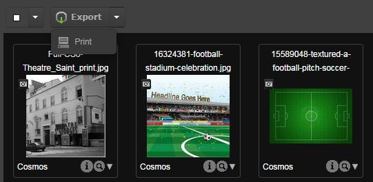
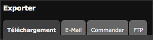
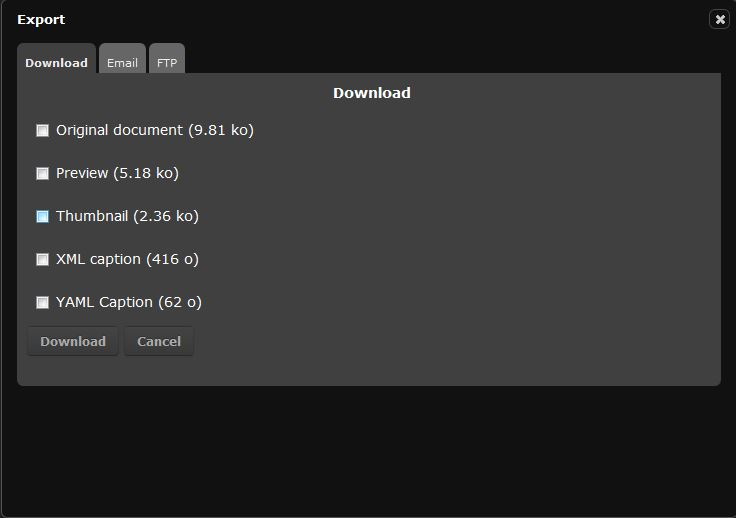
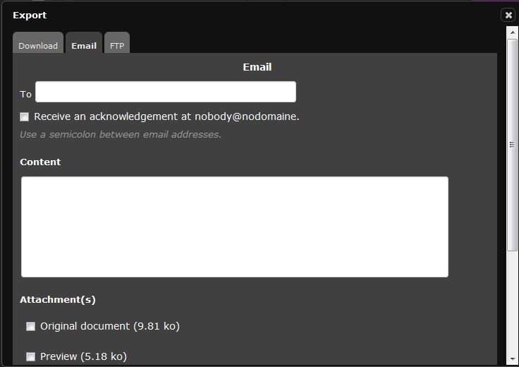
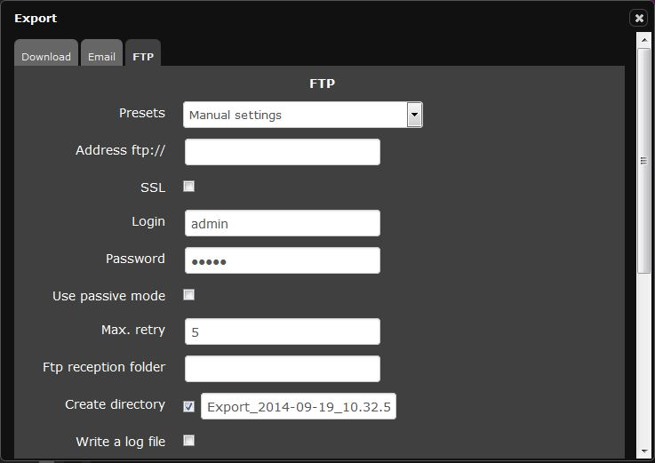
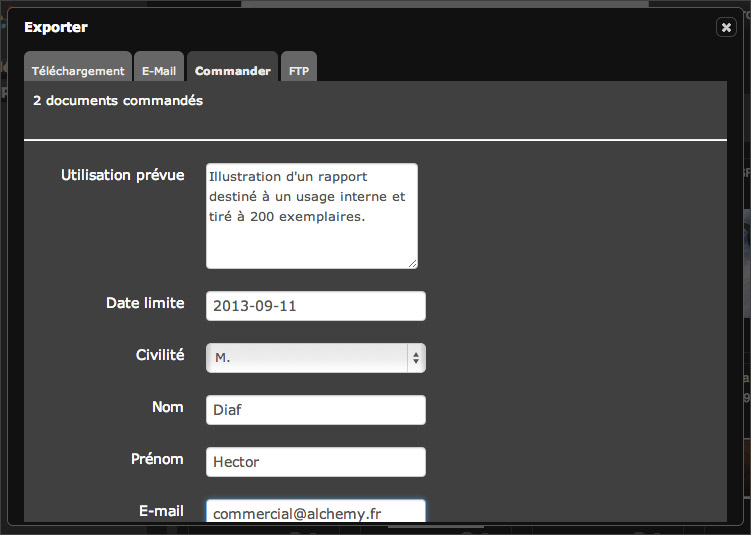
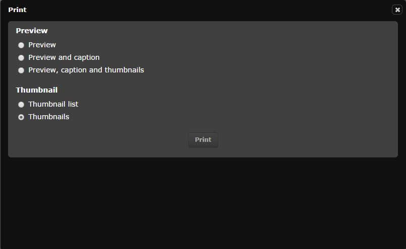
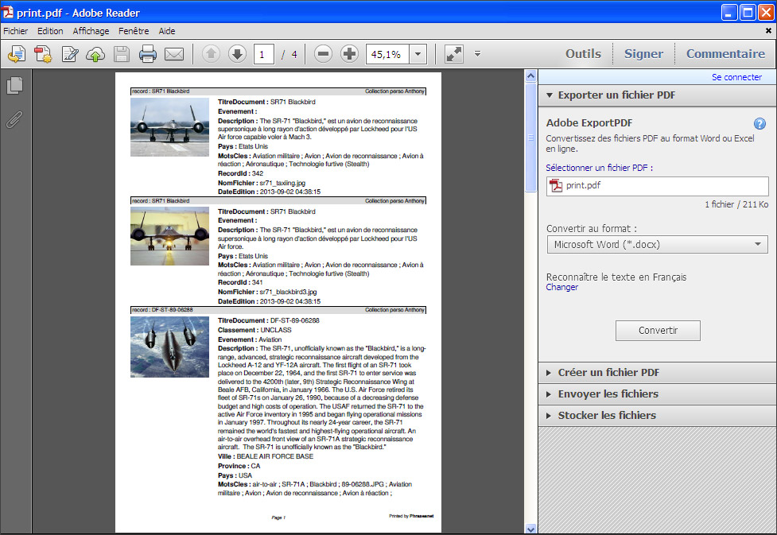

To export and print
====================
.. toctree::
    :maxdepth: 3

.. topic:: The essential

    To `Export`_ is one of the available action in :
	doc:`Actions panel <Actions>` in *Phraseanet Production*.
    Several export modes are available : download, sending by e-mail or 
    transmission via :term:`FTP <FTP>`.

    The `Print`_  action is a PDF export type.

Export
------

This action allows to export :

* the original document
* the sub definitions of documents
* the instructions with the `XML <https://wikipedia.org/wiki/Xml>`_ or
  `YAML <https://wikipedia.org/wiki/Yaml>`_ format

*The weight of the elements to export are displayed next to each formats.*

It is possible to export the media or the contents of the baskets and stories
one by one or in batches from the:doc:`Results display <Display>` zone or from
 the :doc:`Baskets and stories display <Basketstories>` zone.

By clicking on **Export**, 4 export options are available :

* **download** : It allows to transfer data on the hard disk of the computer 
  with a zipped file (for example Export.zip).
* Sending by e-mail : It allows to send to recipients a link that enable them
  to have access to the media in a zipped file.
* The Order tab allows to order documents that require to control the use.
* Sending by FTP : If the setting of the application allows it, the sending by
  FTP allows to drop the exported media on a files server that supports FTP
  connections.

.. note::

    The export can be done threw batches of documents, coming from several 
	Phraseanet bases or collections, on which the user may not have some user 
    rights.
    In this case, the number of documents that can be exported is indicated.

Export by download
******************

* Select one or several thumbnails and click on the *Export* icon.
* The download window displays.
* Use the boxes to tick in order to select which element has to be imported.
* Click on *Download*.
* Follow the procedure proposed by the browser.

The export by e-mail
********************

* Enter the e-mail of the recipient, use the semi-colon " ; " in case of a 
  sending to several recipients.
* Enter the subject of the e-mail.
* Select the files that have to be attached to the downloadable zipped archive
  via the available link in the body of the e-mail.
* Complete the e-mail message if necessary.
* Click on "Send".

.. note::

    Once the download is transmitted.

* Click on "Send".
* A sending confirmation displays.

FTP
***

This tab allows to enter manually the destination address of the FTP server, and
can also use presets.

.. note::

    Presets correspond to the FTP addresses entered in "My account".

Documents requests
******************

This tab allows to do download requests for the users who have no downloading 
rights.

Fill in and submit the displayed form.

The order manager is informed of the order by a notification in Phraseanet or by
an notification by e-mail.

Print
-----
this action allows to print the thumbnails, specific pictures, media description
in a self generated PDF document.

* Select one or several media, then click on "Print".

The print window opens.

Tick the boxes corresponding to the selection made:

* Specific picture, to only print the specific pictures.
* Specific picture and legend, to only print the specific pictures and the 
  description of the document.
* Specific pictures and description with contact sheet, to print the specific 
  pictures and description and also the thumbnails  gathered in one contact sheet.
* Thumbnails list, to print the thumbnails list.
* Contact sheet, to print the thumbnails gathered in one contact sheet.

Click on **Print**. the requested documents displayed with the PDF format
PDF (*Acrobat format of Adobe* - *Acrobat reader* or another software able to 
read PDF files have to be installed on the computer).
Print the PDF document or save it on the computer's hard disk.

