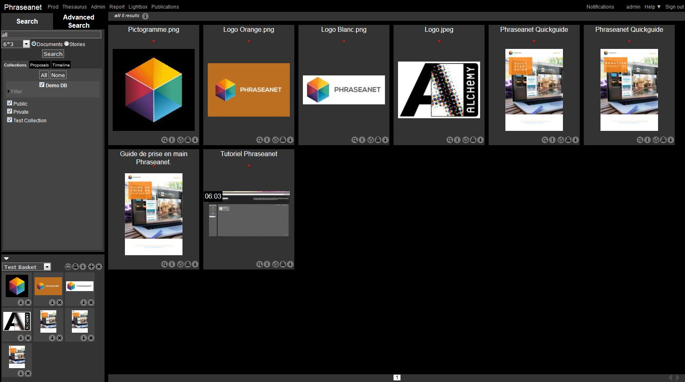
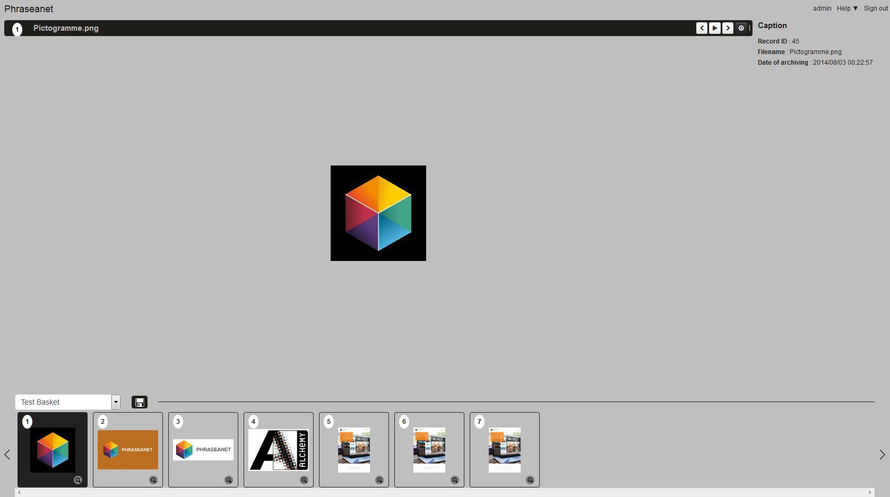
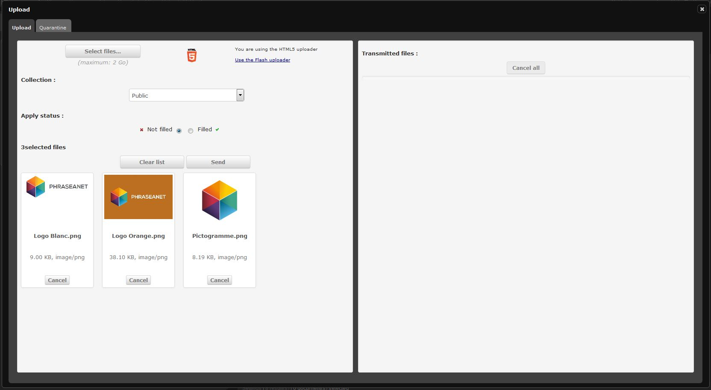
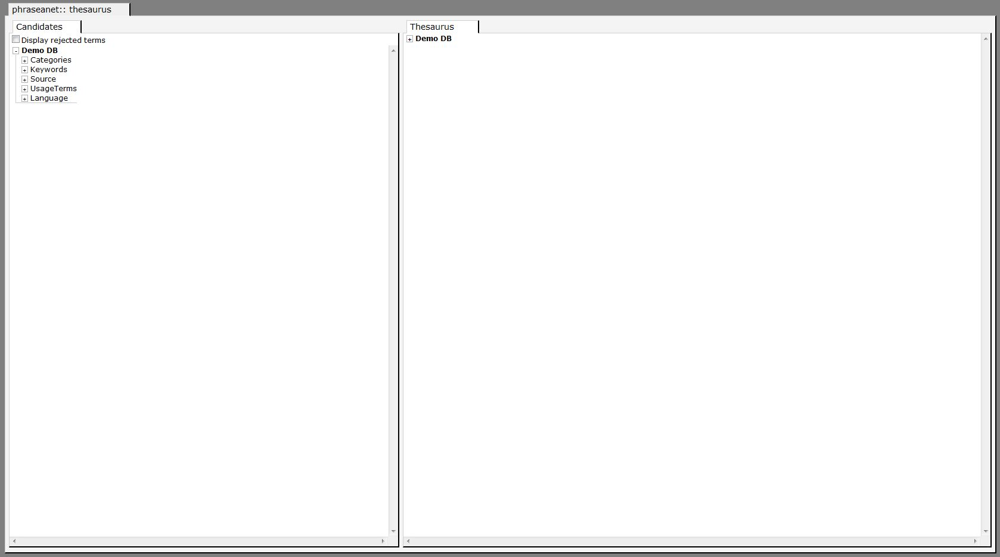
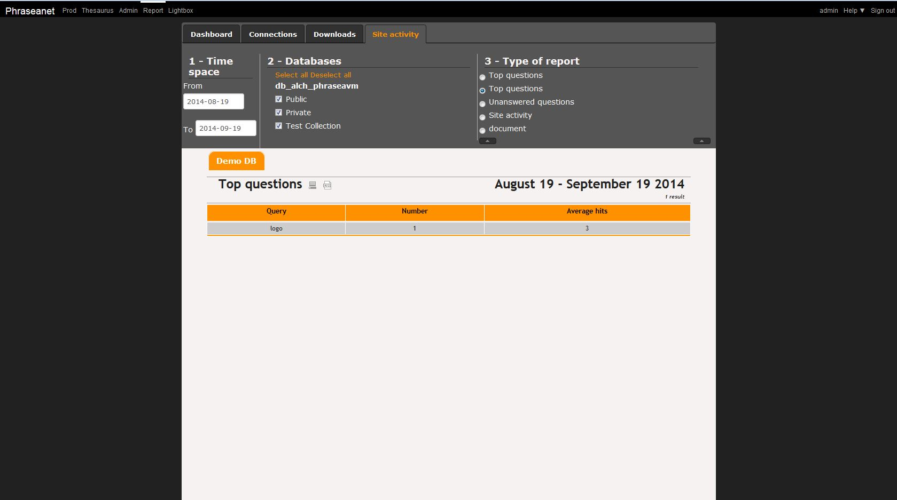

Introduction to Phraseanet
==========================
.. toctree::
    :maxdepth: 4

General information
-------------------

*Phraseanet* is a digital asset management solution.

It targets all the professionals which need a powerful tool to secure the
management and broadcast of their images, videos, sounds and other multimedia
or office documents.

Installed either on a local or remote server, it runs through a web browser.

To use Phraseanet
-----------------

The user must have a computer equipped with internet and a recent internet
browser.
JavaScript support must be activated and the plug-in
`Adobe Flash Player <http://get.adobe.com/fr/flashplayer/>`_ installed.
The user must also have a valid eMail address.

.. note::

	On Windows PC, Internet Explorer 7 is the minimum recommended version.
	However, *Phraseanet Classic" allows access to the assets using obsolete
	versions like Internet Explorer 6.

	The use of Internet Explorer 6 is not recommended for the other Phraseanet
	modules, as it is not recommended to use *Phraseanet Classic" with recent
	browsers.

The Phraseanet modules
----------------------

Phraseanet is a complete solution to archive, organize and broadcast multimedia
documents.

The solution is based on seven modules or interfaces, accessible from the main
bar, depending on the user rights :

* Phraseanet `Production`_
* Phraseanet `Classic`_
* Phraseanet `Lightbox`_
* Phraseanet `Upload`_
* Phraseanet `Administration`_
* Phraseanet `Thesaurus`_
* Phraseanet `Report`_

Production
**********
*Phraseanet Production* is the most important interface for many users.
Complete, this interface allows to :doc:`search <Search>`,
:doc:`edit <Edit>`, :doc:`display and organize <Display>`,
:doc:`and share <Push>` your documents.

Depending on the user rights, *Production* allows the users to browse assets
and download, the managers to import, describe organize and broadcast their
media.

.. figure:: ../../images/Production-areas.jpg
    :align: center

Classic
*******

*Phraseanet Classic* is a consultation interface for the final users who have
older web browsers. It allows to :doc:`read documents <Display>`.

Lightbox
********

Collaborative interface, *Phraseanet Lightbox* allows to view and/or download
specific documents sent by *Phraseanet* users. Validation features allows to
:doc:`read users feedback on the media <Push>`.

To send, share, compare documents in *Phraseanet Lightbox*, see the section
:doc:`Push and Validation <Push>`.

Upload
******

Available only from the Production interface, *Phraseanet Upload* allows
rightful users to import media documents in Phraseanet from their hard drive.
This upload manager allows to transfer media without using a :term:`FTP <FTP>`
tool.

:doc:`How to upload documents in Phraseanet ?<Upload>`

Administration
**************

:doc:`Phraseanet Administration <Administration>` is an admin interface allowing
to manage and monitor the application, create Phraseanet bases and 
:term:`collections <Collection>`, declare documentary structures, create users
and manage their rights.

.. image:: ../../images/General-Administration.jpg
    :align: center

:doc:`Refer to the section Administration <Administration>`.

Thesaurus
*********

:doc:`Thesaurus <Thesaurus>` creation and management is possible in *Phraseanet*
The *Phraseanet Thésaurus* is used jointly with *Phrasea* search engine. It is 
not compatible with the *Sphinx* search engine.
Along the management of generic and specific keywords, the Phraseanet Thesaurus
handles synonyms and linguistic relations.  
It is #un vrai plus in using the digital asset management solution.

For more information about the Phraseanet Thesaurus, please refer to
:doc:`this section<Thesaurus>`.

Report
******

Using :doc:`Statistics <Statistics>`, *Phraseanet Report* gives a detailed view
of a *Phraseanet* system activity and sums up the #comportement utilisateur. It
is a datamine to optimize the access to the assets and know better the users
habits.

Please refer to the section doc:`Statistics <Statistics>` for a detailed
presentation of this module.
