Import
======

.. toctree::
    :maxdepth: 3

.. topic:: The essential

    Relying on a :term:`HTML5` technology, the interface *Phraseanet Upload*
    is accessible in Production via a a link located in title bar of the
	Phraseanet menu. 
    *Upload* is an interface dedicated to the addition of media towards
    some collections on which the user have some addition rights.

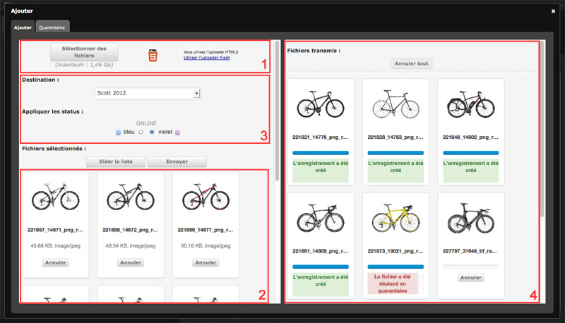

.. note::

    For browsers that don't have the full HTML5 support, a display mode lying on
    the Adobe plug-in `FlashPlayer <http://get.adobe.com/fr/flashplayer/>`_ is 
    available in *Phraseanet Upload*.
	
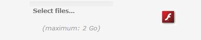

Click on the link **Use the Flash uploader** to use this mode.
This Flash mode offers a downgraded display mode. It does not allow to access 
all the features developed with the HTML5 technology.

How to add media ?
------------------

Click on Upload in the :doc:`menu <General>` Phraseanet.

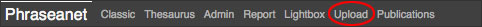

*Phraseanet Upload* starts in an Overlay window.

Select files
************

Click on **Select files**.

The application launches the files explorer of the computer.
Go to the file where are located the files, select the files,  then click on
**Open**.

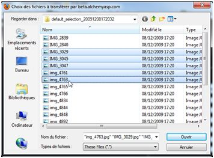

The interface displays the list of the files, identifiable by the thumbnails 
displayed at the bottom of the screen.

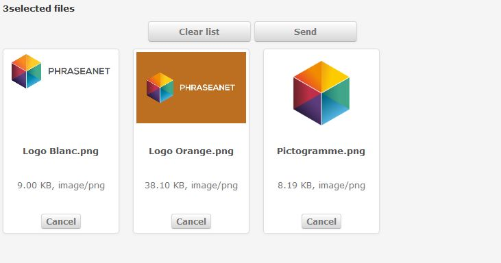

Choose the collection of destination
************************************

Select the collection of destination, in the drop-down list of the available 
collections.

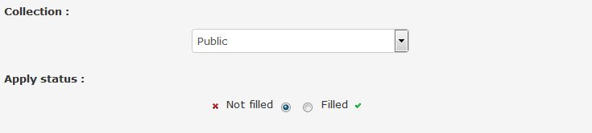

Apply status
************

If necessary, apply the :term:`status` (optional).

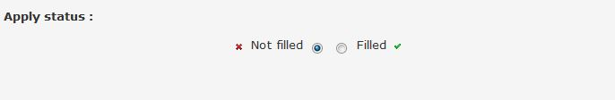

Reorder the media
******************

If necessary, the user can reorder the media before importing them.
Select a file and drag and drop it elsewhere in the list. The user can also 
choose to take out from the list one or several images by clicking on the Cancel
button under each thumbnails, or even reset the sending list by clicking on the
button **clear the list**.
Otherwise, click on **Send** to transmit the files towards *Phraseanet*.

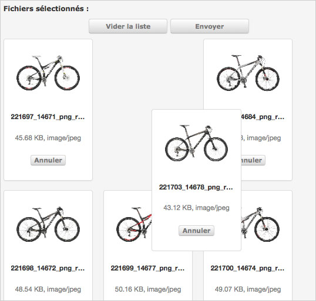

Transmit the media
******************

When the user clicks on **Send**, all the media are transferred towards the 
selected *Phraseanet* collection.
The upload is represented by progress on the right side of the window.
(« Transmitted files »).

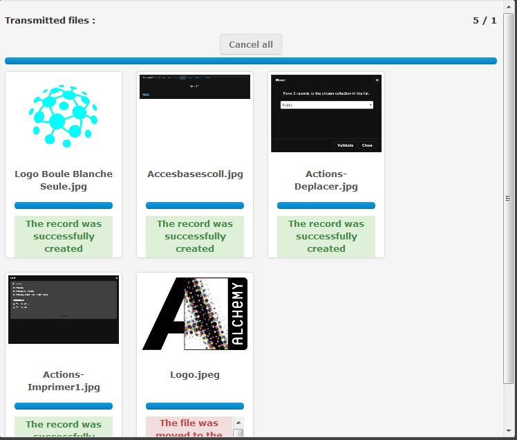

A general progress bar and a progress bar per document allow to follow the state
of transfer.

During the transfer, media are added to the collection of destination.

After the transfer, media are transmitted and available for consultation in the
interfaces *Phraseanet Production* (consultation and documents management) and
 *Classic*(consultation only).

Quarantine
--------------

During the addition of files, some files can be placed in **Quarantine**.

Click on the tab **Quarantine** to display it from the *Upload* window.

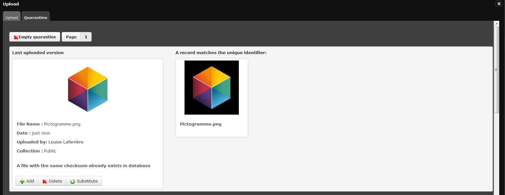

The quarantine is a dedicated space where are located the files awaiting actions
from the user.
By default, the quarantine is only activated if some files are identified as
duplication of existing documents previously uploaded by default. The analyse 
relies on the examination of a unique universal identifier. 
(UUID for *Universally Unique IDentifier*).

Quarantine also allows to isolate some files that don't fulfil the relevant
criteria determined by the administrator system.

For more information about the setting of additional criteria of quarantine
retention, consult the dedicated paragraph at **Custom services** on
:doc:`this page<../../../Admin/Configuration>`.

Durin the *upload*, a media placed in quarantine is notified by a red colour 
symbol.

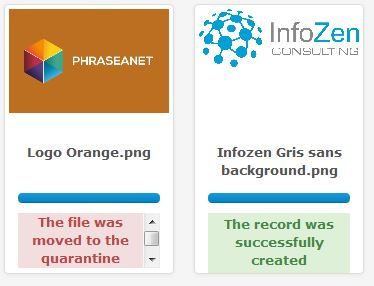

In the quarantine space, the reason why the file is located in quarantine is 
indicated for each file : (duplication, mismatch with the eligibility criteria
(format, colorimetry, dimensions)...*etc*.

Three choices are offered to the user :

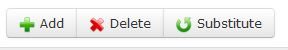

* **Add** the file as a new record in the initially chosen collection.
* **Remove** the file
* **Substitute** the actual file

The user decide what is the best action to do in order to empty the files queue
in the quarantine space.

Then go to the next document.

The **Quarantine** can also be entirely removed if necessary. To do so click on 
the button **Remove the quarantine** at the top left of the screen.
