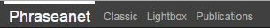
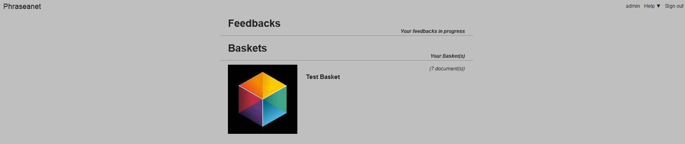
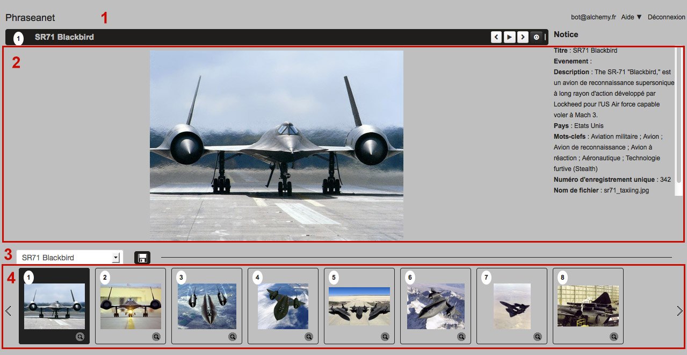
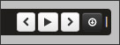
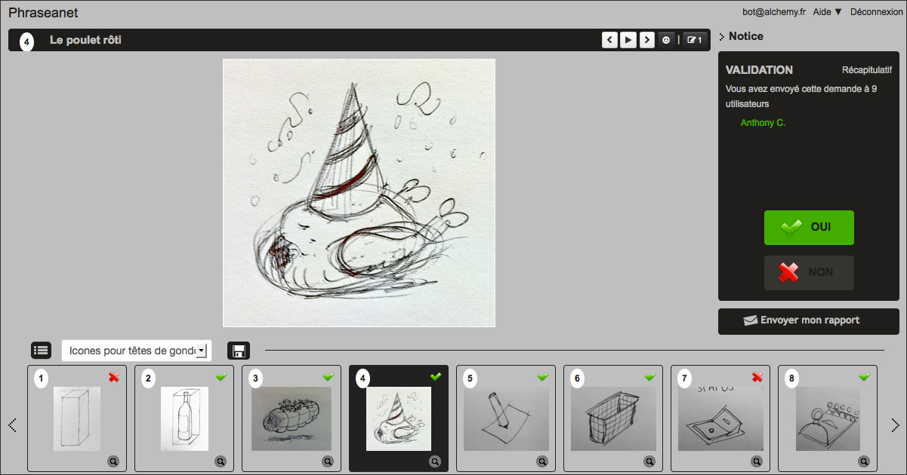

Lightbox
========

.. toctree::
    :maxdepth: 3

.. topic:: The essential

    *Phraseanet Lightbox* collaborative viewing interface.
	If has comparison features, disporama, export and allows to validate and
	comment media.
	It allows the non authenticated users to view pictures without
	authentication.

Access the Lightbox
-------------------

For the non authenticated users
*******************************

This interface is accessible by clicking on the HTML link of the email sent when
a Phraseanet user sends a :doc:`Push or validation request <Push>`.

.. image:: ../../images/Lightbox-email_reception.jpg
    :align: center

For authenticated users
***********************

Lightbox is available in the menu bar of the Phraseanet applications.

Click on the section **Lightbox** of the menu to join *Phraseanet Lightbox*.

The window displays a list of **Push** and of **validation demands** that the
user have made or received.

The interface
-------------

The interface of Lightbox is simple and intuitive.

* **1**. The action bar gives the title of the displayed media, allows to
  browse the records and gives access to download the media.
* **2**. The lightbox, at the center, shows the media, its description and its
  characteristics. This area is different if it is a **Push** or a
  **Validation request**
* **3**. A menu area allows to browse through Push and Validations
* **4**. The thumbnail area lists the media of the lightbox

Browse
******

To browse the Lightbox media :

* Select using the mouse a picture to display in the thumbnails viewing area
* Use the keyboard arrows
* Use the forward or backward arrows located at the right of the action menu

Slide show
**********

To launch a slide show of the Lightbox media, click on the button **play** of
the action menu.

Download media
**************

To download the displayed media on the lightbox, click on the save icon in the
action menu.

.. image:: ../../images/Lightbox-save.jpg
    :align: center

To download all the media of a lightbox, click on the button on the botton left
of the interface.

.. image:: ../../images/Lightbox-save-all.jpg
    :align: center

The download from *Phraseanet Lightbox* suggests some options like the Export
options from *Phraseanet Production*.

.. image:: ../../images/Lightbox-save-export.jpg
    :align: center

`Refer to the export section in Phraseanet Production <Export>`_.

Compare two media
*****************

If can be useful to compare two media side by side.

.. image:: ../../images/Lightbox-compare.jpg
    :align: center

* display a first media on the lightbox by clicking on its thumbnail
* while pressing **Ctrl** (PC Windows) or **Cmd** (Mac OS) on the keyboard, 
  click on the media to compare with.

This system is really useful when :doc:`validation documents <Push>`.

Validate documents in the Lightbox
----------------------------------

The documents validation in *Phraseanet* is an opinion request on the media.
The user whom the validation request is sent gives his opinion by **yes** or
**no** and can make a comment if he wishes to.

To add a comment, click on the tooltip in the action menu.

.. image:: ../../images/Lightbox-validation_opinion.jpg
    :align: center

After the validation, click on the **Send my report** button.

The issuer of the validation request will be immediately notified of the
opinions and comments.
