Phraseanet menu
---------------
.. toctree::
    :maxdepth: 2

.. topic:: The essential

    The *Phraseanet* menu bar allows to access the different interfaces of the 
	application, the user account settings and some information and resources.

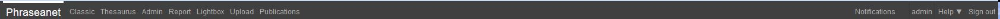

Access to interfaces
********************

All the *Phraseanet* interfaces offer at the top of the window, an identical 
menu in the menu bar.

**the left part of the menu bar displays the list of the interfaces that the
user can access.** By clicking on an application's name, the internet browser 
launches the application in a new tab or a new window. 

**The sections in the menu bar depend on the users rights.**

Users who have only assets consultation rights have a limited access to the
sections.

.. image:: ../../images/General-menu0.jpg
    :align: center

Others users, such as administrators, have a more complete menu bar.

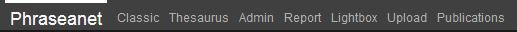

.. note::

    If an interface is missing in the menu bar, it is a matter of rights.
	
    If a user have no access to specific features, the link to the interface 
	using it does not appear.

**The right part of the menu bar** displays notifications, the account
identifier, on-line help with the keyboard short-cuts and the disconnection 
link.

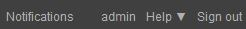

Notifications access
********************

The notifications are some information messages displayed in real time in the 
interface *Phraseanet Production*.
Notifications give some information about the new available publications, 
validation requests, baskets receiving... *etc* to the user.

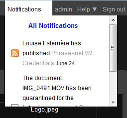

Refer to the section
:doc:`personnaliser l'interface <PersonnaliserInterface>`.

Account setting access
**********************

Click on the user identifier displayed.
A new page opens and displays the forms and the gathered lists in some tabs.

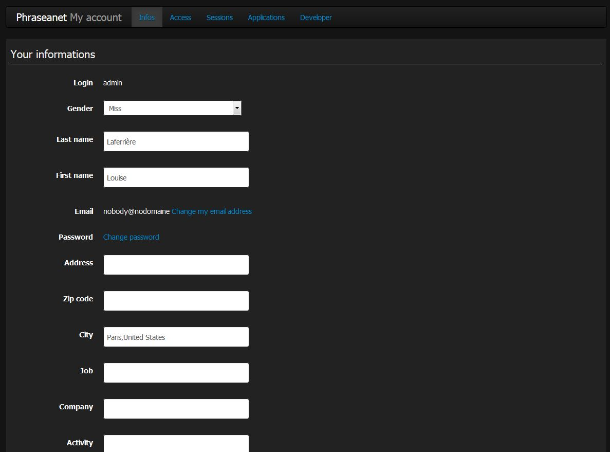

Information
^^^^^^^^^^^

The information tab gathers personal information. The offered form allows to 
complete or modify information relating to the identity, addresses details, phone
numbers, e-mails. It also allows to set the *Phraseanet* receiving notification
made by e-mail or to activate an account :`FTP` that allows the receiving of
documents on a server that supports that type of connection.

.. note::

    :doc:`How to activate the receiving of documents on a FTP server ? <../../FAQ/Parametrage/activer-ftp>`

Access
^^^^^^

The *Access* tab lists the Phraseanet bases and collections of the Phraseanet
application.
The tab mentions the collections to which the connected user has access to.
The user can at any time make an access request to additional collections 
offered.

To make a request and access to new Phraseanet base or documents collections and
visualise its content :

* Tick one or several boxes to request access to new Phraseanet 
Bases/collections
* Validate the request by clicking on the *Validate* button.

A message indicates that an access request is in progress.

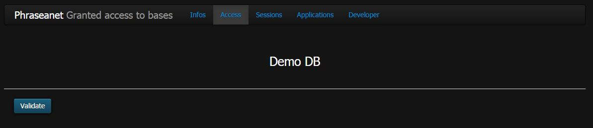

Sessions
^^^^^^^^

The *Sessions* section lists the user's Phraseanet sessions. It gives 
information relating to dates of connections and dates of access to IP addresses
and used browsers.

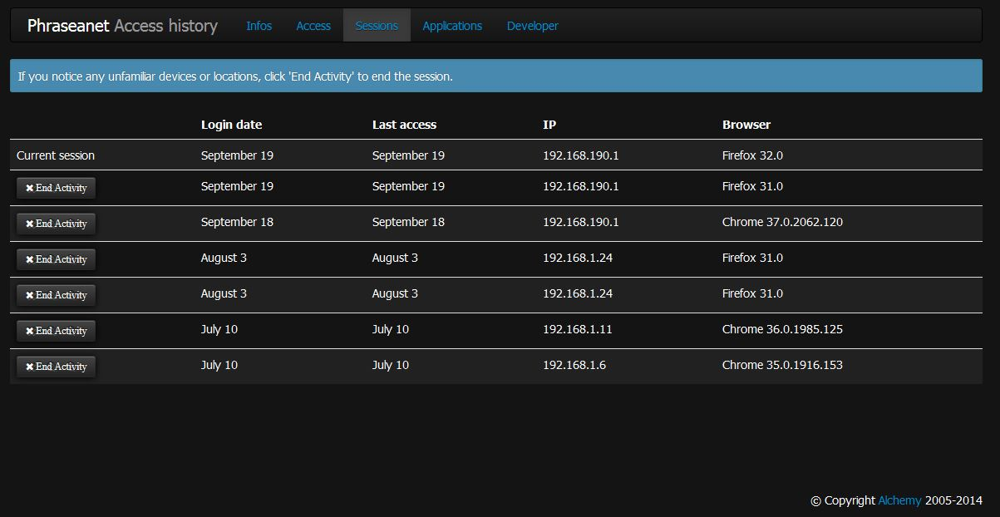

To end one of the listed sessions, use the button provided for that purpose.

Applications
^^^^^^^^^^^^

The *Applications* section lists the third party applications authorized to 
connect the Phraseanet user's account..

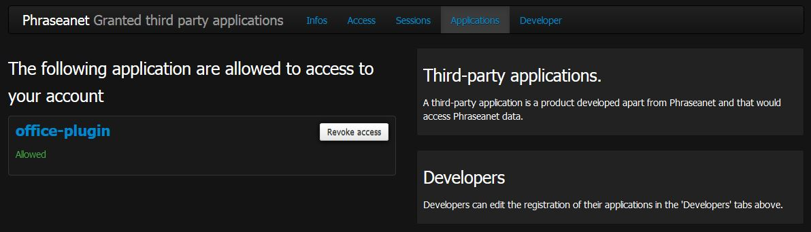

.. note::

  :doc:`How to authorized a third party application to connect to my Phraseanet account ? <../../FAQ/Utilisateurs/ajouter-application>`

Developer
^^^^^^^^^

The *Developer* section allows the set up of the keys of:term:`API` in order
to allow the third party applications to communicate with a Phraseanet account.
A link to the documentation reserved for the developers is available in this 
section. This documentation allows the user to know how to install the 
*Phraseanet* API.

Online Help access
*******************

By clicking on the "Help" tab, the user is redirected to the online 
documentation home page. 
By clicking on the arrow next the "Help" tab, two sub tabs appear :
*Keyboard shortcuts*, and *About*.

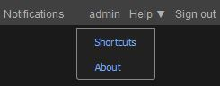

The *Shortcuts* section allows to display a list of the available shortcuts in
 *Phraseanet*.

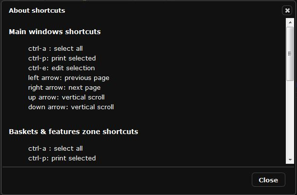

The *About* section allows to display information relating to the Phraseanet
version.

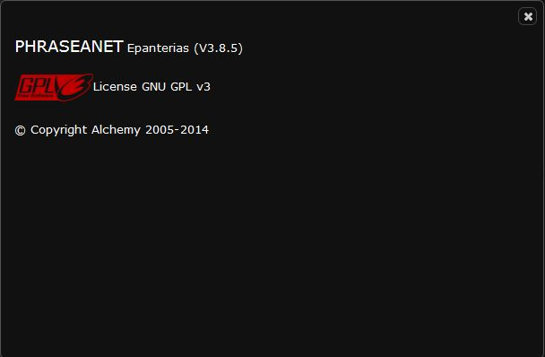

Disconnect
**********

Click on *Disconnect* to end the session and exit *Phraseanet*.

