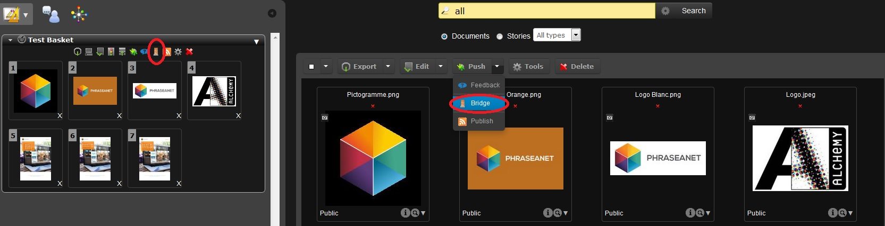

Publish and broadcast with Phraseanet
=====================================
.. toctree::
   :maxdepth: 3

.. topic:: The essential

	Two features of Phraseanet allows to publish and to broadcast media from an
	asset : *Publication* and *Bridge*

.. _Publish-Publications:	

Publish media
-------------

Phraseanet publications allows to give the users
:doc:`baskets <BasketsStories>` and stories in the publication page.
These publications are available as RSS media stream outside of the application
and usable from third party applications.

* Open the baskets tab in *Phraseanet Production*.
* Click on the title menu of the basket to show its menu.
* Click on the icon **Publish** (orange RSS stream icon).

* Click on the title menu of the basket to show the action menu.

* Click on the **Publish** (orange RSS stream icon).

A window opens:

.. image:: ../../images/Publish-Basket2.jpg
    :align: center

Some fields can be filled :

* The publication title
* The sub title
* Author
* Author's email

To finish filling the informations:

* Choose the feed available in the list (the feeds are created in the section
  :doc:`Publications <AdministrationSolution>` of *Phraseanet Admin*).
* Finally click on **Publish** to validate

The publication is done.

It is now visible in the *Phraseanet Publications*

**The user can access it by clicking on the *Publications* link in the
Phraseanet menu bar** :

.. image:: ../../images/Publish-menu.jpg
    :align: center

After clicking on *Publications* in the menu bar, the publication appears :

.. image:: ../../images/Publish-Display.jpg
    :align: center

Third party applications, like Phraseanet Showcase, can also use publications.
They are available as RSS media streams outside the application.

.. _bridge-share:

Broadcast with bridge
---------------------

The **Phraseanet Bridge** allows to publish pictures and other multimedia
documents to external sites, like :

* `FlickR`_
* `YouTube`_
* `Dailymotion`_

To publish documents to these sites, select the documents, connect a 
`Flickr <http://www.flickr.com/>`_,
`YouTube <http://www.youtube.com/>`_ or
`Dailymotion <http://www.dailymotion.com/>`_ account to Phraseanet, and publish.

Media selection
***************

* Select one or more media in *Phraseanet Production*. These can be selected
  documents in the display area, or regrouped in baskets or stories.
* Click, in the :doc:`action menu <Actions>`, on the pop-up menu of the "Push"
  button.

Two choices are available: "Bridge" and "Publish" :

* Click on **Bridge**

Sign in
*******

The **Bridge** window opens:

* Click on **New** to connect to the chosen account : Phraseanet can connect to
  a Flickr, Youtube, Dailymotion... account.

.. image:: ../../images/Bridge-1b.jpg
    :align: center

The site asks for authentication, then to give permission to Phraseanet to
connect.

Once connected, the Bridge retrieves the existing information from the remote
application.

With Flickr, the existing pictures are displayed in the ""Photos" or "Photosets"
tab if they are organized in albums in Flickr.

Publish on Flickr
*****************

Select the media in the display area, then click on the **Add** button.

The "Upload" window of Bridge opens. Modify the selected images titles, add the
tags and describe your medias in the description forms.

* Click on the **Add** button on the bottom left.

When the images are sent, it is possible to view the transfer progress by
clicking on the tab **Sent files**.

.. image:: ../../images/Bridge-4.jpg
    :align: center

* The status **OK** tells the media pictures or videos have been transfered.
* A date information indicates since when the transfer was made.

Launch *Flickr*. The media are available.

.. image:: ../../images/Bridge-5.jpg
    :align: center
