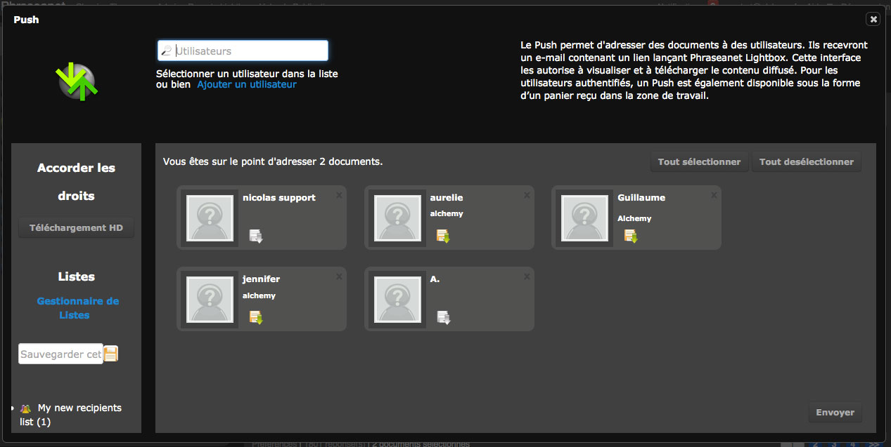
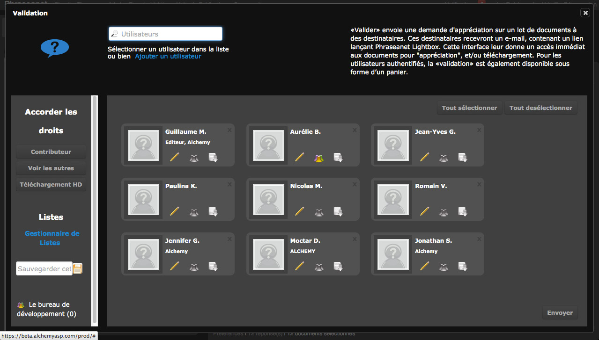
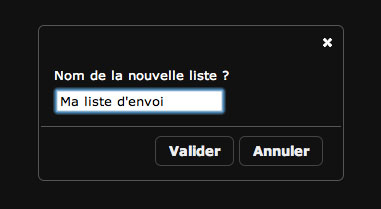
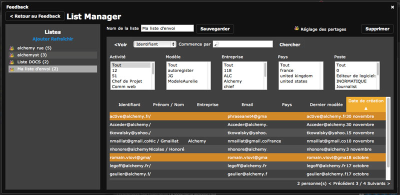

Push and validation
===================

.. toctree::
    :maxdepth: 3

.. topic:: The essential

    The *Push* and the *Validation* are two actions intended to transmit 
	documents to users, whether they have Phraseanet accounts or not.

    The *Push* is used to push documents toward those users, the *Validation*,
	is intended to collect advisory opinion from the users about media.

    A `Lists manager`_ allows to create sending lists to answer some 
	repetitive sending towards the same users.

Push
----

The Push is a submission of documents in :doc:`Phraseanet Lightbox<Lightbox>`.
Reversely to the e-mail sending proposed by the export features, the*Push*
does not transmit the documents physically.
It notifies in the *Production* interface, and also notifies by e-mail, and 
leave at the users disposal some media selections coming from baskets that they 
can consult and eventually download.

How to push documents ?
***********************

* Select one or several documents in the display area 
  doc:`Results <Display>` of the *Production* interface.

* Click on the **Push** button of the :doc:`Actions range <Actions>` :
  An Overlay window opens and displays the *Push* window.

* Select one or several *Phraseanet* users to push toward them the selected
  documents.

To do so, write their family names, first names or e-mail address in the field 
of the form proposed on the top left of the interface. An auto-completion device
is activated as soon as the third character is entered in order to facilitate
the research of the user.
Once the Phraseanet user is detected in the proposed users list, click on his 
name in order to add him to the sending list. This action add the user in the 
recipient area of the sending.

To add one or several non registered users in a Phraseanet solution to a 
sending list, click on the link *Add a user*.
A simplified form to add users displays.
Fill in at least the mandatory fields recognizable by an asterisk then click
on the "Add" button. This action add the created contact in the recipient area
of the sending and create an account in its name in the Phraseanet system in the
same time.

.. note::

    The users listed in the recipient area of the sending can be gathered and 
	saved in the sending lists in order to be reused afterwards.
    To save a sending list, fill in the fields of the form located on the left 
	of the recipient area then save by clicking on the icon :

    .. image:: ../../images/Push-icone-disquette.jpg
        :align: center

    The created list is then displayed in the sending lists area. 
    Features related to the sending lists are described after in the dedicated
	section at `Lists manager`_.

.. warning::

    To be able to create users from Pushs and Validations, the user must have
	the necessary users management rights.

To give some specific high definition downloads rights,(or *Grant rights*) on 
the documents pushed to users appearing in the sending list, two methods are
available:

* Select one or several users in the recipient area, then click on the 
   *HD download* button located on the left of the sending users list.

**Or**:

* Click on the icon located on the representative sticker of each recipient,
  that gives the right for an high definition download.

* Click on the *Send* button to validate and to transmit the Push.

A form is available to give a more convivial name and description to the sending
and allows to ask for an acknowledgement of receipt of the sent e-mail if this
feature is supported by the recipient e-mail server.

Validation 
----------

The operating mode is nearly the same as a Push sending. The only difference is
the giving out of additional or optional benefits.

* Select one or several documents in the display area of the production 
  interface results.
* Click on the Validation section of the Phraseanet's actions range of the Push 
  menu : An Overlay window opens and displays the Validation window.

* Select the Phraseanet users who will receive the Validation request, in the 
  same way as for a Push. To address this request to non registered users on the
  application, the operating mode is also the same as for a Push.

The increase of additional rights(Grant rights) works the same way as a Push.
Rights that can be delegate are more dense.

In addition to the **High definition download**, it is possible to allow the 
recipient to contribute to the request validation, this is the default option.

**To activate or deactivate this option**, click on the **Contribute** button or
on the icon.

The **See others** button and is related icon

allow a recipient to visualise opinion and comments sent by other recipient
about the Validation request.

To validate and to transmit a Validation request, click on the *Send* button. 
A form is available to set the period of validity of a Validation request, and 
to give a convivial name and description to the elements taken up by the
recipients in the received e-mail.
In a same way, to claim an acknowledgement receipt of a Validation request, tick
the box provided for that purpose, if the e-mail server of the recipient takes 
account of it.

Push or Validation receiving in the Phraseanet Lightbox
-------------------------------------------------------

Push and Validation are notified in two different ways :

*  By notification in the Phraseanet Production interface.

*  By email.

Each notification mode has a permanent link allowing the display in Phraseanet 
Lightbox.
*Push* and *Validations*  received are gathered in the module 
:doc:`Phraseanet Lightbox <Lightbox>`, which is a collaborative consultation 
interface.

Lists manager
-------------

.. topic:: The essential

    The *Lists manager* allows to set up and administrate the recipients lists 
    for the diffusion of *Push* and *Validation* in *Phraseanet Lightbox*.
    In this way, it becomes even more easy to diffuse media or to ask to 
	appreciate them in *Phraseanet*.

The *Lists manager* is accessible from the Push and Validation windows of the
Production module of the Phraseanet application. click on the link 
*Lists manager* located on the left zone of the sending recipients area.

Create and edit a sending list
******************************

To create a new list in the *Lists manager*, click on the link *Add*.

* Give a name to the new list in the displayed form, then validate the form. The 
  name of the created list displayed in the list area on the left of the 
  interface. Click on its name to visualise its content.

* Click on the *Edit* button on the left of the central area of the 
  *Lists manager* interface to edit a list's content. This action allows to 
  present the list of the users identified in a Phraseanet system.

* To add one or several users in a sending list, select the lines of the users
  to add.
  The added users or presents users in the edited list are highlighted in ochre.
* To remove one or several users from the edited sending list, select the lines
  of the corresponding users : This action allows to remove them from the list.

.. note::

    A research device and filters allow to limitate the display of the users by
	their login, family name or first name, activity, company...*etc.*

* To go back to the list's summary, click on the *See* button.

Share a list
************

To share sending lists with other Phraseanet users and allocate them some user,
management or administration rights, Display the list to share by 
selecting it in the list area.

**To share a list with a Phraseanet user**, search the user by his family name,
first name, login, or e-mail address in the search form. An auto-completion 
device facilitate this research.

Once the user is identified, add him to the share by clicking on its 
presentation sticker. His name is added to the list of Phraseanet users who
share that sending list.

By default, sharing access are allocated in accordance with the level of access
granted.

* The **Access** level gives access to read-only mode on the sending list
* The **Editor** level gives access to read and write mode on the sending list
  content.
* The **Admin** level gives access to read and write mode and allows also to 
  remove some shared lists.

remove a list
*************

**To remove a sending list**, select it in the list of the sending lists. the
list displays, then click on the **Remove** button located on the top right of
the interface.
A window displays and asks for a removal confirmation. click on *Ok* to remove 
definitively the list.

.. note::

    If the name of the removed list still appears in the list of the sending
	lists, click on the *Refresh* button located on the left of the interface.
    
