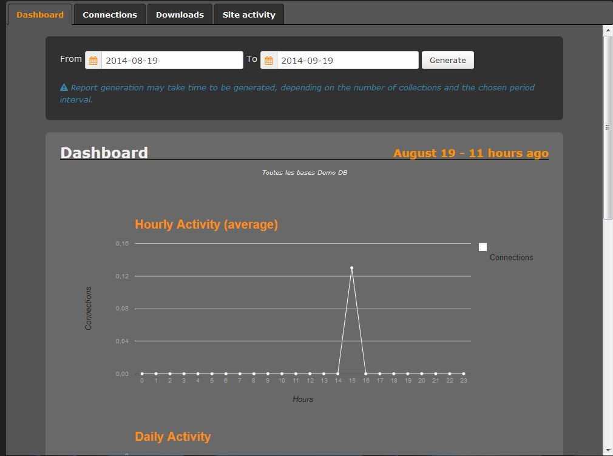
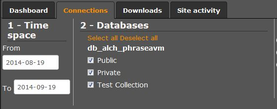

Statistics
==========

.. toctree::
    :maxdepth: 3

.. topic:: The essential

    Numerous statistics are available in *Phraseanet*. In Production, stats on
	the documents are published in the tabs of the detailed view.
	
	**Report** gives more detailed informations on the site's activity.

Reports are sorted in 4 tabs :

At the launch of a module, a dashboard offers a set of general statistics on
a one month period.

The three other tabs offer statistics relating to the *users connections*, the
*downloads*  of documents and the *website activity*.

Dashboard
---------

Statistics offered by the dashboard are global for all the Phraseanet
:term:`bases <base>`and collections published from the website and based on a 
rolling month.

.. image:: ../../images/Statistiques-Tableaudebord.jpg
    :align: center

The dashboard includes numerous statistics data.

Here is a list of the available tables and their contents.

* **Activity per hour** : Content and information not definitive(curves).
* **Activity per day** : Content and information not definitive(curves).
* **Added documents** : Number of documents added in a day (Histogram).
* **Edited documents** : Number of edited documents per day(Histogram).
* **Downloads and connections accumulation** : Total number of downloads, 
    documents of all sub definitions on one month.
* **Total number of users connections**
* **Most active users** (Tableau)
* **Preview of the most downloaded media** (Table)
* **Most frequent questions** : List of the 10 most frequent questions asked by 
    the users
* **Volumetry of the most frequent question on Phraseanet** : List of the users
    who ask the more questions.(Table)
* Websites where the documents are the most consulted.(Table)

The three following tabs: `Connection`_, `Downloads`_ and
Website activity`_, display the same way : The user has to select 3 criteria in
order to have access to the statistics :

* `Period`_
* `Bases`_
* `Reports types`_

Connections
-----------

The user click on the "Connection" tab if he wants to see how many connections 
have been done on his Phraseanet system.

Period
******

By default, the period is defined on the previous month.
To change the interval, click on one of the two date input areas.

Use an interval proposed by the three calendars.
To go back to a distant past, use the first calendar.

Phraseanet Bases
****************

Select the:term:`bases <base>` and collections from which the statistics have to
be obtain from.

Click on **Every bases** to display the list of the available data bases.
Two buttons allow to to select/deselect all the :term:`bases
<base>`.

A pop-up menu (arrow on the bottom left corner) allows to display 
collections list of the:term:`bases <base>`, in order to refine the reports, by
unchecking the collections to exclude.

.. note::
    The selected options for the bases / collections intervals are stored from a 
	tab to another.

Types of report
***************

Lastly, it is necessary to choose a type of report. Three choices are 
available :

* Set by users :

List and frequency of users connections

* All the connections :

List of all the connections made by each user presented by default with a  
chronological criteria.

* Platforms and browsers :

Set of lists and charts about connections by type of browsers, operating system 
or display resolution used by the users.
This report also presents the Phraseanet modules used for the connections.
Lastly, a list and a chart with the the most used operating systems / browsers 
couples  for the connections.

Click on one of the types of report, and the statistics display immediately.

    Example with a platforms and browsers report

Downloads
---------

The **Download** tab appears the same way as the `Connexion`_ tab :
Select the period, then the :term:`bases <base>` and collections.

The choice of report's type changes. It is possible to display statistics on the
basis of reports :

* By users :

For each user who has done some downloads, this report displays the number and
the weight of the documents and sub definitions.

* All the downloads :

List of the whole of the downloads done on the interval.
This table proposes features of gathering, sorting, ...*etc*.

* By day :

Total number of downloads done per day and distribution per documents and 
sub-definitions.

* By document, on the Phraseanet base :

Activates an option that allows to check if a specific document using its
RecordId, or if a document for which a term to search is found in a field,
has been downloaded over the period.

    Example of statistics report per document on the Phraseanet base.

Website Activity
----------------

This tab displays the same way as the two previous tabs.
Select the period and the :term:`base` then the available report's types:

* **All the questions** chronological list of questions asked by the users.
* **Most usual questions** list of the most usual questions and the number of
    occurrences returned.
* **Unanswered questions** list of the unanswered questions
* **Website activity** gives information relating to the activity per hour
  (average).

    Example of report including data relating to the most usual questions.

Reports
-------

Reports appear as tables, lists and charts that display expected information and
suggest some options. Reports precise the date interval of the report.

Reports display all the results from the requested report. Some of the tables
offer some options to display more, or to reduce the number of columns.

Click on the wheel to display the list and to select / deselect the display 
of specific columns.

Most of the tables, lists and charts are printable by clicking on the printer 
icon.

Reports are generated by the :term:`base` and take account of the collections 
exclusion filters.

To browse in the list "tabs" of the :term:`bases <base>`, position the cursor 
at the beginning or at the end of the list.

Some columns of the reports tables offered are implemented with :

* sort functions
* filter functions

Filters are relating to available values in the column.

* Logical merging by identical values.

Some values in the columns are underlined links recognizable by mousing over 
them. By clicking on one of those values an :term:`Overlay` window opens and 
displays some information relating to the value.

Reports are spread on several pages when they are composed of a significant 
number of lines.

This information is displayed at the bottom of the page, and it is possible to :

* Change the page
* Display more lines by changing the entered value.

.. note::
    The total number of available lines correspond to the total number of 
	results.
