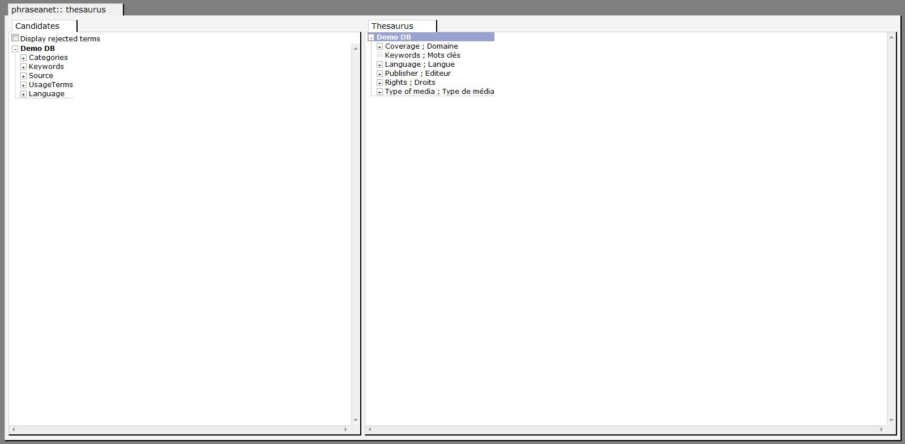

Thesaurus
=========

.. toctree::
    :maxdepth: 3

.. topic:: The essential

	The application **Phraseanet Thesaurus** allows to manage the thesaurus
	linked to a *Phraseanet* base.

	A Thesaurus can be used to manage synonyms, translations, and help users
	with their searches.
	The goal of a thesaurus is to help to index and facilitate the documents
	search in a database.
	The thesaurus is proposed in *Phraseanet Production* as a tool to help the
	indexation.
	The Thesaurus also helps to browse through the assets and make suggestions
	in order to expand or narrow the number of results of searches.

.. warning::

	A thesaurus is a very powerful tool and its implementation can seem easy but
	can need Documentation knowledge depending on its final use and the expected
	results.

Open a Thesaurus
----------------

In the **Thesaurus** application  :
* -> Choose a Thesaurus in the list
* -> Choose a working language
* -> Click on Validate

* => The Thesaurus window opens

The Thesaurus application window is in two parts.

The left part of the window displays the list of the **candidate terms**, terms
and expressions from the documents indexation and the list of rejected or
deleted terms that are displayed by the indexation field of the database.

The right part displays the existing Thesaurus, as a tree that can be deployed.
When putting the mouse cursor on a branch or a term, we display in rollover all
the synonyms associated and the number of appearances in the database.

To open a branch, click on the "+"
To close a branch, click on the "-"

Work on a Thesaurus
-------------------

Create a new specific term
**************************

Adding a new specific term to a branch means that we add a lower lever term, it
is a "Master / Detail" relation (or Specific term / Generic term).
A new specific term in the thesaurus can be added on any existing branch from
the main branch called **Thesaurus**.

* -> Right click on a branch
* -> Click on **new term**.

* => A window opens

.. image:: ../../images/Thesaurus-newterm.jpg
    :align: center

* -> Type the term
* -> Type if needed a context
* -> Select a language for the term
* -> Click on **Validate**

* => A window opens if the term is not part of the candidates.

.. image:: ../../images/Thesaurus-newtermindex.jpg
    :align: center

By default, the checkbox **Add terms without re-indexation** is checked.

Check Phraseanet Production to see if the term already exists in the Phraseanet
base, and in this case, a re-indexation is necessary so that the documents note
and the thesaurus terms can be linked.

* -> Check **Add the term and re-index**

.. note::
	The immediate re-indexation is not necessary if other terms are not yet
	added. The re-indexation can be launched after from **Phraseanet Admin**.

* -> Click on **Validate**

Create a new synonym
********************

A synonym takes into account the translating needs and the synonyms needs.

* -> Right click on a branch
* -> Click on **New synonym**.

* => A window opens

.. image:: ../../images/Thesaurus-newsynonym.jpg
    :align: center

* -> Type the term
* -> Type if needed the context between brackets
* -> Select a language for the term
* -> Click on **Validate**

* => A window opens if the term is not part of the candidates.

.. image:: ../../images/Thesaurus-newtermindex.jpg
    :align: center

By default **Add a term without re-indexation** is checked.

See if it is necessary to re-index the Phraseanet base.

* -> Check **Add the term and re-index**

.. note::
	The immediate re-indexation is not necessary if other terms are not yet
	added. The re-indexation can be launched after from **Phraseanet Admin**.

* -> Click on **Validate**

Delete a branch or a term
*************************

* -> Right click on a branch
* -> Click on **Delete**.

* => A window opens

.. image:: ../../images/Thesaurus-delete.jpg
    :align: center

* -> Click on OK

The branch or the term are deleted from the thesaurus and copied in the *Stock*
branch of the candidates.

Search in the thesaurus
***********************

* -> Double click on a branch
* -> Click on **Search**.

* => A window opens

* -> Choose among the search options
* -> Click on search

* => The thesaurus display is refreshed and the terms found are displayed.

Link one or more branches of the thesaurus to a documentary field
*****************************************************************

* -> Right click on a branch
* -> Click on **Search**.

* => A window opens

.. image:: ../../images/Thesaurus-linktofields.jpg
    :align: center

* -> Check the fields to link
* -> Click on Validate

.. note::
	All the new terms contained in the documents documentary sheets that will be
	added, or that the indexation will be modified, will appear as candidate
	terms in a branch named after the field.

Work on the candidates
----------------------

The candidate terms are the new terms and expressions that were added during the
indexation of new words by the Phrasea engine in the database.
These terms can either come from informations extracted from the metadatas of a
file that was added, or on the informations types from the Edit window in
Phraseanet Production.
For term coming from a field to become candidate terms, a Phraseanet base
structure field must be linked to a branch of the thesaurus.

Accept a candidate
******************

* -> Click on the candidate term in the Stock window and drag/drop at the root
  or on a branch of the thesaurus in the thesaurus window

* => A window opens

* -> Choose to add as a specific term or a synonym
* -> Click on **Validate**

Reject a candidate
******************

* -> Right click on a term
* -> Click on **Reject**

* => A window opens

Delete a candidate
******************

* -> Right click on a term
* -> Click on **Delete**

* => A window opens and indicate if the term must be moved in the *Stock* branch
  of the candidate terms. Validate to delete the term of the published thesaurus
  